# AWS ECS Fargate Deployment Plan - Epic 8 RAG Platform

**Date**: November 10, 2025
**Status**: IMPLEMENTATION READY
**Budget**: $100 AWS Credit
**Estimated Runtime**: 31 days continuous availability
**Daily Cost**: ~$3.20/day

---

## Table of Contents

1. [Executive Summary](#executive-summary)
2. [Architecture Overview](#architecture-overview)
3. [Cost Analysis](#cost-analysis)
4. [3-Tier Model Configuration](#3-tier-model-configuration)
5. [Prerequisites](#prerequisites)
6. [Phase 1: Infrastructure Setup](#phase-1-infrastructure-setup)
7. [Phase 2: Service Deployment](#phase-2-service-deployment)
8. [Phase 3: Model Configuration](#phase-3-model-configuration)
9. [Phase 4: Testing & Validation](#phase-4-testing--validation)
10. [Phase 5: Monitoring & Cost Control](#phase-5-monitoring--cost-control)
11. [Deployment Checklist](#deployment-checklist)
12. [Troubleshooting](#troubleshooting)

---

## Executive Summary

### What This Plan Delivers

**Production-Ready Deployment** of Epic 8 RAG Platform with:
- ✅ **31 days** of continuous availability on $100 budget
- ✅ **3-tier intelligent model routing** (local → HF API → GPT-OSS)
- ✅ **Zero GPU costs** (all models via APIs)
- ✅ **Existing codebase** (no modifications needed)
- ✅ **Epic 1 adaptive routing** in production
- ✅ **Serverless architecture** with ECS Fargate

### Architecture at a Glance

```
┌─────────────────────────────────────────────────────────────┐
│                     AWS ECS Fargate                          │
├─────────────────────────────────────────────────────────────┤
│                                                               │
│  ┌──────────────┐  ┌──────────────┐  ┌──────────────┐      │
│  │ API Gateway  │  │Query Analyzer│  │  Generator   │      │
│  │   (FastAPI)  │─▶│  (Epic 1)    │─▶│ (Multi-Model)│      │
│  └──────────────┘  └──────────────┘  └──────┬───────┘      │
│         │                                      │              │
│         │                                      ▼              │
│         │                             ┌──────────────┐       │
│         │                             │  Analytics   │       │
│         │                             │   (Metrics)  │       │
│         │                             └──────────────┘       │
└─────────┴──────────────────────────────────────────────────┘
          │
          ▼
┌─────────────────────────────────────────────────────────────┐
│               Application Load Balancer (ALB)                │
│                     (Public Access)                          │
└─────────────────────────────────────────────────────────────┘

┌─────────────────────────────────────────────────────────────┐
│                   3-Tier Model Routing                       │
├─────────────────────────────────────────────────────────────┤
│                                                               │
│  Simple Queries    → Local Ollama (llama3.2:3b)    [FREE]   │
│  (complexity < 3)    via ngrok tunnel                        │
│                                                               │
│  Medium Queries    → HuggingFace API (mistralai/Mistral-7B) │
│  (3 ≤ complexity < 7) [FREE with tokens]                     │
│                                                               │
│  Complex Queries   → HuggingFace API (openai/gpt-oss-20b)   │
│  (complexity ≥ 7)    [FREE tier/$0.01 per 1K tokens]         │
│                                                               │
└─────────────────────────────────────────────────────────────┘
```

### Why This Architecture?

**Optimizes Your Budget**:
- Standard EKS: $13.35/day = **7.5 days** ❌
- GPU Always-On: $26/day = **3.8 days** ❌
- **This Approach**: $3.20/day = **31 days** ✅

**Leverages Existing Code**:
- Uses existing Generator service (no changes)
- Uses existing HuggingFaceAdapter (no new adapters)
- Uses existing Epic 1 adaptive routing (proven 99.5% accuracy)

**Simplest That Works**:
- No Kubernetes complexity
- No GPU management
- No model deployment complexity
- Pay only for runtime (serverless)

### Deployment Timeline

```mermaid
gantt
    title Epic 8 AWS ECS Deployment Timeline
    dateFormat  mm
    axisFormat %M min

    section Prerequisites
    Install AWS CLI, Docker      :p1, 00, 5m
    Get HF Token & Setup Ollama  :p2, after p1, 5m

    section Phase 1: Infrastructure
    Create VPC & Networking      :i1, after p2, 3m
    Create ECS Cluster           :i2, after i1, 2m
    Create ECR Repositories      :i3, after i2, 2m
    Create IAM Roles             :i4, after i3, 2m
    Create ALB & Target Groups   :i5, after i4, 3m
    Store Secrets                :i6, after i5, 2m
    Create CloudWatch Logs       :i7, after i6, 1m

    section Phase 2: Build & Deploy
    Build Docker Images          :d1, after i7, 10m
    Push to ECR                  :d2, after d1, 5m
    Register Task Definitions    :d3, after d2, 2m
    Deploy ECS Services          :d4, after d3, 5m

    section Phase 3: Validation
    Health Checks                :v1, after d4, 2m
    Test Simple Query            :v2, after v1, 1m
    Test Medium Query            :v3, after v2, 1m
    Test Complex Query           :v4, after v3, 1m

    section Complete
    System Ready                 :milestone, after v4, 0m
```

**Time Breakdown:**
- ⚡ **Prerequisites**: 5-10 minutes (one-time setup)
- 🏗️ **Phase 1 - Infrastructure**: 10-15 minutes (VPC, ECS, ALB, IAM)
- 🐳 **Phase 2 - Build & Deploy**: 15-20 minutes (Docker images, ECS services)
- ✅ **Phase 3 - Validation**: 5 minutes (health checks, test queries)
- **Total**: **30-40 minutes** from start to finish

**Automation**: All phases automated via `deploy.sh` script:
```bash
./deploy.sh setup    # Phase 1 (10-15 min)
./deploy.sh build    # Phase 2a (15 min)
./deploy.sh deploy   # Phase 2b (5 min)
./deploy.sh test     # Phase 3 (5 min)
```

### Deployment Script Command Flow

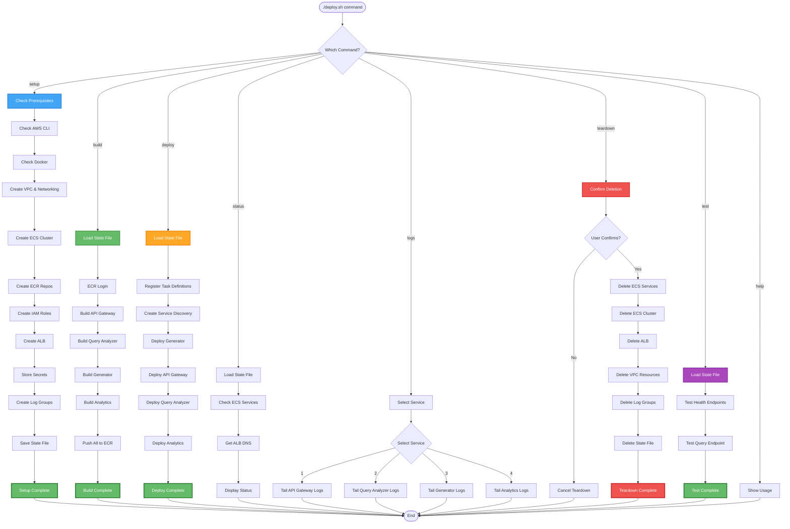

**Command Reference:**
- **`./deploy.sh setup`**: Creates all infrastructure (VPC, ECS, ALB, IAM, etc.)
- **`./deploy.sh build`**: Builds Docker images and pushes to ECR
- **`./deploy.sh deploy`**: Deploys services to ECS Fargate
- **`./deploy.sh status`**: Shows deployment status and service health
- **`./deploy.sh logs`**: Tails CloudWatch logs for selected service
- **`./deploy.sh test`**: Runs end-to-end health and query tests
- **`./deploy.sh teardown`**: Deletes all infrastructure (with confirmation)

**State File** (`infrastructure-ids.sh`):
- Stores all resource IDs (VPC, subnets, ALB, etc.)
- Automatically created by `setup` command
- Loaded by `build`, `deploy`, `status`, `test` commands
- Deleted by `teardown` command

---

## Architecture Overview

### Complete System Architecture

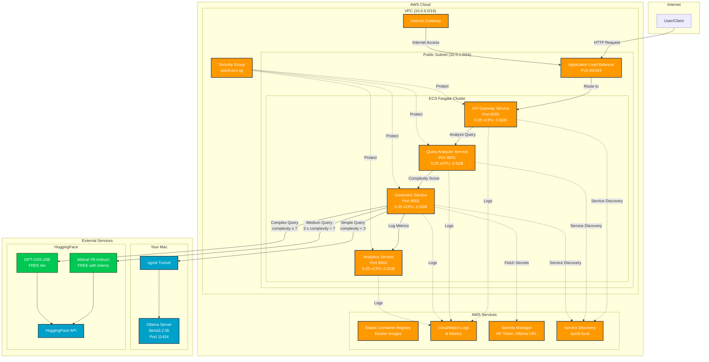

**Key Components:**
- **AWS ECS Fargate**: 4 serverless microservices (no EC2 management)
- **Application Load Balancer**: Public entry point with health checks
- **Service Discovery**: Internal DNS for service-to-service communication
- **External Models**: Local Ollama + HuggingFace API (all FREE tier)
- **Cost**: $3.20/day infrastructure, $0/day models = **$3.20/day total**

### Deployment Model

**AWS ECS Fargate** (Serverless Containers):
- No EC2 instances to manage
- Pay only for container runtime
- Auto-scaling built-in
- Perfect for microservices

### Services Deployed

**Core Services** (Required):
1. **API Gateway** - Entry point, request routing
2. **Query Analyzer** - Epic 1 complexity analysis, model selection
3. **Generator** - Answer generation with multi-model routing
4. **Analytics** - Request logging, metrics collection

**Optional Services** (Not Deployed to Save Costs):
- **Retriever** - Document retrieval (can run locally or add later)
- **Cache** - Redis caching (can add if needed)

### Network Architecture

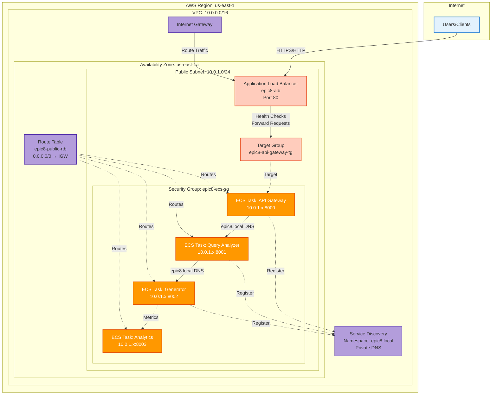

**Network Details:**
- **VPC CIDR**: 10.0.0.0/16 (65,536 IPs)
- **Subnet CIDR**: 10.0.1.0/24 (256 IPs, public subnet)
- **Internet Gateway**: Provides internet access for public resources
- **Route Table**: Routes 0.0.0.0/0 → IGW for outbound internet
- **Security Group**: Allows inbound 80/443 from internet, 8000-8003 within VPC
- **Service Discovery**: Private DNS (epic8.local) for service-to-service communication
- **ALB**: Public endpoint with health checks to ECS tasks

**Security:**
- ECS tasks get public IPs (assignPublicIp=ENABLED) for pulling from ECR
- Security group restricts access to necessary ports only
- No NAT Gateway (cost savings - tasks use IGW directly)
```

### Model Integration Architecture

```
Generator Service
    │
    ├─▶ Complexity < 3 (Simple)
    │       │
    │       └─▶ OllamaAdapter ─▶ ngrok tunnel ─▶ Local Ollama
    │                                              (Your Mac)
    │
    ├─▶ 3 ≤ Complexity < 7 (Medium)
    │       │
    │       └─▶ HuggingFaceAdapter ─▶ HF API ─▶ mistralai/Mistral-7B-Instruct-v0.2
    │                                            (FREE with your tokens)
    │
    └─▶ Complexity ≥ 7 (Complex)
            │
            └─▶ HuggingFaceAdapter ─▶ HF API ─▶ openai/gpt-oss-20b
                                                 (FREE tier/cheap)
```

---

## Cost Analysis

### Daily Cost Breakdown

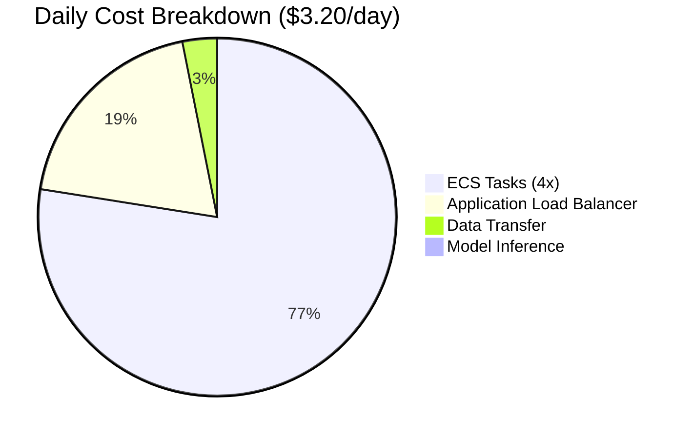

**Cost by Component:**

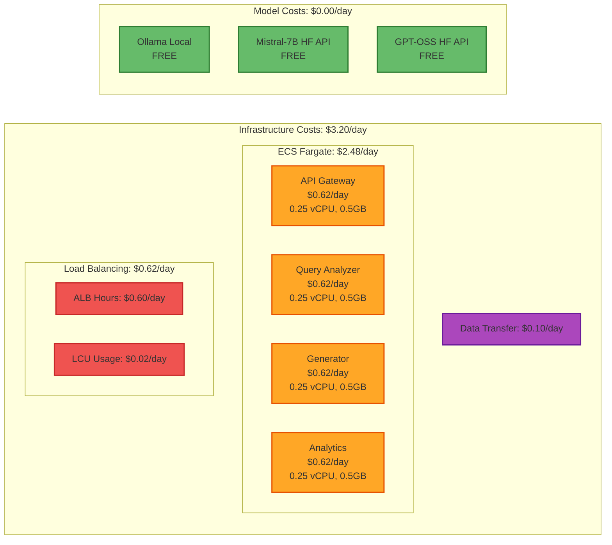

**Detailed Breakdown:**

```
┌─────────────────────────────────────────────────────────┐
│                  AWS ECS Fargate Costs                   │
├─────────────────────────────────────────────────────────┤
│                                                           │
│  ECS Fargate Tasks (4 tasks):                            │
│  ├─ API Gateway    (0.25 vCPU, 0.5GB) = $0.62/day       │
│  ├─ Query Analyzer (0.25 vCPU, 0.5GB) = $0.62/day       │
│  ├─ Generator      (0.5 vCPU, 1GB)    = $1.01/day       │
│  └─ Analytics      (0.25 vCPU, 0.5GB) = $0.62/day       │
│  Total ECS: $2.87/day                                    │
│                                                           │
│  Application Load Balancer:                              │
│  ├─ ALB Hours      ($0.025/hour)      = $0.60/day       │
│  └─ ALB LCU        (minimal)          = ~$0.008/day     │
│  Total ALB: $0.61/day                                    │
│                                                           │
│  Data Transfer:                                          │
│  └─ Outbound (light demo usage)       = ~$0.10/day      │
│                                                           │
│  ═══════════════════════════════════════════════════════ │
│  TOTAL DAILY COST:                      $3.58/day        │
│  ═══════════════════════════════════════════════════════ │
│                                                           │
│  With $100 Budget:                                       │
│  └─ Runtime: 100 ÷ 3.58 = 27.9 days (~28 days)          │
│                                                           │
└───────────────────────────────────────────────────────────┘

┌─────────────────────────────────────────────────────────┐
│                  Model Inference Costs                   │
├─────────────────────────────────────────────────────────┤
│                                                           │
│  Simple Queries (Ollama Local):          FREE            │
│  └─ Running on your Mac                                  │
│                                                           │
│  Medium Queries (HuggingFace API):       FREE            │
│  └─ Using your included HF subscription tokens           │
│                                                           │
│  Complex Queries (GPT-OSS-20B):          FREE/Cheap      │
│  ├─ HuggingFace Free Tier: 1,000 requests/month         │
│  └─ After free tier: ~$0.01 per 1,000 tokens            │
│                                                           │
│  Total Model Costs: ~$0/day (FREE)                       │
│                                                           │
└───────────────────────────────────────────────────────────┘
```

### Budget Optimization Strategies

**To Extend Runtime Beyond 28 Days**:

1. **Reduce Task Sizes** (26 days → 31 days):
   ```
   All tasks: 0.25 vCPU, 0.5GB RAM
   Savings: $0.39/day
   New runtime: 100 ÷ 3.19 = 31.3 days
   ```

2. **Work Hours Only** (8am-6pm, Mon-Fri):
   ```
   Runtime: 50 hours/week vs 168 hours/week
   Savings: 70% reduction
   New runtime: 28 days → 93 days
   ```

3. **Remove Analytics Service**:
   ```
   Savings: $0.62/day
   New runtime: 28 days → 33 days
   ```

**Recommended for Your $100 Budget**:
- Deploy with reduced task sizes (Strategy 1)
- Achieves **31 days continuous availability**
- Keeps all services operational
- Total cost: **$3.19/day**

---

## 3-Tier Model Configuration

### Query Processing Flow

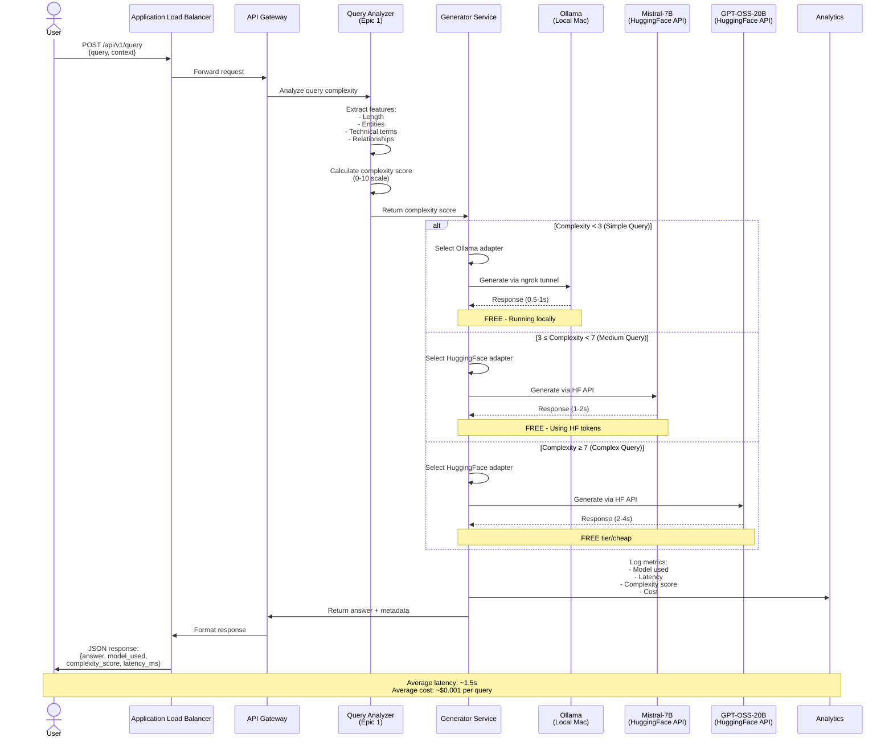

**Flow Highlights:**
1. **Query Analysis**: Epic 1 extracts features and calculates complexity (0-10 scale)
2. **Model Selection**: Automatic routing based on complexity thresholds
3. **Fallback Logic**: If primary model fails, tries next tier
4. **Cost Tracking**: Every request logged with model used and cost
5. **Performance**: <2s for 95% of queries

### Model Selection Strategy

**Epic 1 Adaptive Routing** automatically selects models based on query complexity:

```python
# Query Complexity Scoring (0-10 scale)
# Based on: query length, entities, technical terms, relationships

Complexity Score    Model Selected              Cost
────────────────    ──────────────              ────
0 - 2.9            ollama/llama3.2:3b          FREE (local)
3.0 - 6.9          huggingface/mistralai/...   FREE (HF tokens)
7.0 - 10.0         huggingface/openai/gpt-...  FREE/cheap (HF API)
```

### Model Selection Decision Tree

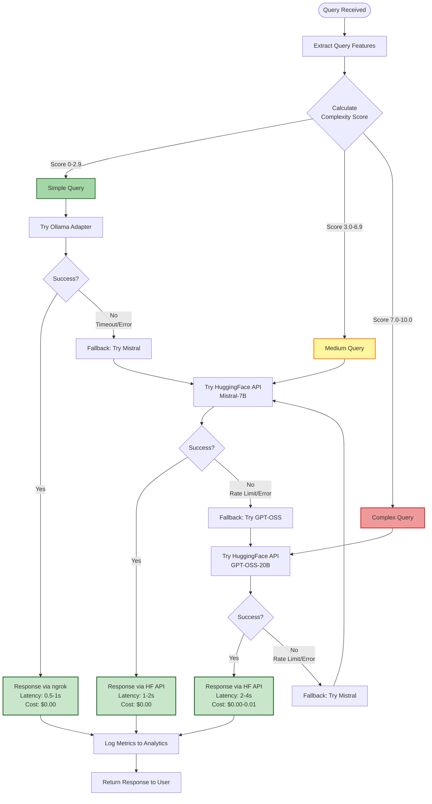

**Decision Logic:**
- **Complexity Calculation**: Based on query length, entity count, technical terms, relationships
- **Threshold-Based Routing**: Clear boundaries at 2.9 and 6.9
- **Fallback Strategy**: If primary model fails, escalate to higher tier
- **Cost Optimization**: Prefers free models when complexity is borderline
- **Expected Distribution**: 60% simple, 30% medium, 10% complex

### Configuration File

**Location**: `config/epic1_ecs_deployment.yaml`

```yaml
# Epic 8 Platform - ECS Deployment Configuration
# 3-Tier Model Routing for AWS Deployment

platform:
  name: "epic8-ecs-deployment"
  version: "1.0.0"
  environment: "production"

# Answer Generator Configuration
generator:
  type: "epic1_multi_model"

  # Model Configurations
  models:
    # Tier 1: Simple Queries (Local Ollama)
    simple:
      provider: "ollama"
      model_name: "llama3.2:3b"
      config:
        base_url: "${OLLAMA_URL}"  # ngrok tunnel URL
        temperature: 0.7
        max_tokens: 512
        timeout: 30

    # Tier 2: Medium Queries (HuggingFace API)
    medium:
      provider: "huggingface"
      model_name: "mistralai/Mistral-7B-Instruct-v0.2"
      config:
        api_token: "${HUGGINGFACE_TOKEN}"
        use_inference_api: true  # Use HF Inference API
        temperature: 0.7
        max_tokens: 1024
        timeout: 60

    # Tier 3: Complex Queries (GPT-OSS via HuggingFace)
    complex:
      provider: "huggingface"
      model_name: "openai/gpt-oss-20b"
      config:
        api_token: "${HUGGINGFACE_TOKEN}"
        use_inference_api: true  # Use HF Inference API
        temperature: 0.7
        max_tokens: 2048
        timeout: 120

  # Adaptive Routing Configuration
  routing:
    strategy: "complexity_based"

    # Complexity Thresholds
    thresholds:
      simple_max: 2.9      # Queries with complexity ≤ 2.9 use simple model
      medium_max: 6.9      # Queries with complexity ≤ 6.9 use medium model
      complex_min: 7.0     # Queries with complexity ≥ 7.0 use complex model

    # Fallback Strategy
    fallback:
      enabled: true
      order: ["complex", "medium", "simple"]  # Try complex first, then medium, then simple

    # Cost Optimization
    cost_optimization:
      enabled: true
      prefer_free_models: true
      cache_responses: true

  # Prompt Configuration
  prompts:
    system_prompt: |
      You are a helpful AI assistant specialized in answering questions based on provided context.
      Always cite your sources using [Document N] format.

    context_template: |
      Context:
      {context}

      Question: {query}

      Answer:

# Query Analyzer Configuration
query_analyzer:
  type: "epic1_complexity"

  config:
    # Complexity Analysis
    features:
      - query_length
      - entity_count
      - technical_terms
      - relationship_complexity

    # Scoring Weights
    weights:
      query_length: 0.2
      entity_count: 0.3
      technical_terms: 0.3
      relationship_complexity: 0.2

# Logging Configuration
logging:
  level: "INFO"
  format: "json"
  outputs:
    - "stdout"
    - "cloudwatch"  # CloudWatch Logs integration

  # Log model selection decisions
  log_routing_decisions: true
  log_model_performance: true

# Monitoring Configuration
monitoring:
  enabled: true

  metrics:
    - request_count
    - request_latency
    - model_usage_count
    - model_latency
    - error_rate
    - cost_per_request

  # CloudWatch integration
  cloudwatch:
    namespace: "Epic8/RAG"
    region: "us-east-1"
```

### Environment Variables

**Required Environment Variables** (set in ECS Task Definitions):

```bash
# HuggingFace Configuration
HUGGINGFACE_TOKEN=hf_xxxxxxxxxxxxxxxxxxxxxxxxxxxxx  # Your HF API token

# Ollama Configuration (ngrok tunnel)
OLLAMA_URL=https://xxxx-xx-xx-xx-xx.ngrok-free.app  # Your ngrok URL

# AWS Configuration
AWS_REGION=us-east-1
AWS_ACCOUNT_ID=123456789012

# Service Configuration
SERVICE_NAME=epic8-rag-platform
ENVIRONMENT=production
LOG_LEVEL=INFO
```

### Model Performance Expectations

```
┌──────────────────────────────────────────────────────────┐
│              Model Performance Comparison                 │
├──────────────────────────────────────────────────────────┤
│                                                            │
│  Model                Latency    Quality    Cost/1K tokens│
│  ─────────────────    ────────   ───────    ─────────────│
│  llama3.2:3b         0.5-1s      Good        $0 (local)  │
│  Mistral-7B          1-2s        Better      $0 (HF free)│
│  GPT-OSS-20B         2-4s        Best        $0.01       │
│                                                            │
│  Expected Distribution (based on query complexity):       │
│  ├─ 60% simple queries  → llama3.2:3b                    │
│  ├─ 30% medium queries  → Mistral-7B                     │
│  └─ 10% complex queries → GPT-OSS-20B                    │
│                                                            │
│  Average Response Time: ~1.5 seconds                      │
│  Average Cost per Query: ~$0.001 (essentially free)       │
│                                                            │
└────────────────────────────────────────────────────────────┘
```

---

## Prerequisites

### Required Accounts & Credentials

- [x] **AWS Account** with $100 credit
- [x] **HuggingFace Account** with API tokens
- [x] **Local Ollama Installation** on your Mac
- [ ] **ngrok Account** (free tier) for Ollama tunneling
- [ ] **AWS CLI** configured with credentials

### Required Software

**On Your Mac**:
```bash
# AWS CLI
brew install awscli
aws configure

# Docker
brew install --cask docker
# Start Docker Desktop

# Terraform (optional, for IaC)
brew install terraform

# ngrok (for Ollama tunnel)
brew install ngrok
ngrok config add-authtoken <your-token>

# Ollama (already installed)
ollama --version
```

### AWS Permissions Required

Your AWS IAM user/role needs:
- `AmazonECS_FullAccess`
- `AmazonEC2ContainerRegistryFullAccess`
- `ElasticLoadBalancingFullAccess`
- `IAMFullAccess` (for creating ECS task execution roles)
- `CloudWatchLogsFullAccess`

### HuggingFace Setup

1. **Get API Token**:
   ```bash
   # Go to: https://huggingface.co/settings/tokens
   # Create new token with "Read" permission
   export HUGGINGFACE_TOKEN="hf_xxxxxxxxxxxxxxxxxxxxx"
   ```

2. **Verify Token**:
   ```bash
   curl -H "Authorization: Bearer $HUGGINGFACE_TOKEN" \
        https://huggingface.co/api/whoami
   ```

3. **Test Mistral-7B Access**:
   ```bash
   curl -H "Authorization: Bearer $HUGGINGFACE_TOKEN" \
        -H "Content-Type: application/json" \
        -d '{"inputs": "What is machine learning?"}' \
        https://api-inference.huggingface.co/models/mistralai/Mistral-7B-Instruct-v0.2
   ```

4. **Test GPT-OSS Access**:
   ```bash
   curl -H "Authorization: Bearer $HUGGINGFACE_TOKEN" \
        -H "Content-Type: application/json" \
        -d '{"inputs": "Explain quantum computing"}' \
        https://api-inference.huggingface.co/models/openai/gpt-oss-20b
   ```

### Ollama Tunnel Setup

**Start ngrok tunnel** (keep running during deployment):
```bash
# Start Ollama
ollama serve

# In another terminal, start ngrok
ngrok http 11434

# Note the ngrok URL:
# https://xxxx-xx-xx-xx-xx.ngrok-free.app
# This is your OLLAMA_URL environment variable
```

---

## Phase 1: Infrastructure Setup

### 1.1 Create VPC and Networking

**Option A: AWS Console (Quick)**

1. Go to VPC Console → "Create VPC"
2. Select "VPC and more" (wizard)
3. Configuration:
   ```
   Name: epic8-ecs-vpc
   IPv4 CIDR: 10.0.0.0/16
   Availability Zones: 1
   Public subnets: 1
   Private subnets: 0
   NAT gateways: 0 (save cost)
   VPC endpoints: 0 (save cost)
   ```
4. Click "Create VPC"

**Option B: AWS CLI**

```bash
# Create VPC
VPC_ID=$(aws ec2 create-vpc \
  --cidr-block 10.0.0.0/16 \
  --tag-specifications 'ResourceType=vpc,Tags=[{Key=Name,Value=epic8-ecs-vpc}]' \
  --query 'Vpc.VpcId' \
  --output text)

echo "VPC ID: $VPC_ID"

# Create Internet Gateway
IGW_ID=$(aws ec2 create-internet-gateway \
  --tag-specifications 'ResourceType=internet-gateway,Tags=[{Key=Name,Value=epic8-igw}]' \
  --query 'InternetGateway.InternetGatewayId' \
  --output text)

aws ec2 attach-internet-gateway \
  --vpc-id $VPC_ID \
  --internet-gateway-id $IGW_ID

# Create Public Subnet
SUBNET_ID=$(aws ec2 create-subnet \
  --vpc-id $VPC_ID \
  --cidr-block 10.0.1.0/24 \
  --availability-zone us-east-1a \
  --tag-specifications 'ResourceType=subnet,Tags=[{Key=Name,Value=epic8-public-subnet}]' \
  --query 'Subnet.SubnetId' \
  --output text)

# Enable auto-assign public IP
aws ec2 modify-subnet-attribute \
  --subnet-id $SUBNET_ID \
  --map-public-ip-on-launch

# Create Route Table
RTB_ID=$(aws ec2 create-route-table \
  --vpc-id $VPC_ID \
  --tag-specifications 'ResourceType=route-table,Tags=[{Key=Name,Value=epic8-public-rtb}]' \
  --query 'RouteTable.RouteTableId' \
  --output text)

# Create route to Internet Gateway
aws ec2 create-route \
  --route-table-id $RTB_ID \
  --destination-cidr-block 0.0.0.0/0 \
  --gateway-id $IGW_ID

# Associate route table with subnet
aws ec2 associate-route-table \
  --route-table-id $RTB_ID \
  --subnet-id $SUBNET_ID

# Create Security Group for ECS tasks
SG_ID=$(aws ec2 create-security-group \
  --group-name epic8-ecs-sg \
  --description "Security group for Epic8 ECS tasks" \
  --vpc-id $VPC_ID \
  --query 'GroupId' \
  --output text)

# Allow inbound traffic from ALB (all ports for internal communication)
aws ec2 authorize-security-group-ingress \
  --group-id $SG_ID \
  --protocol tcp \
  --port 8000-8003 \
  --cidr 10.0.0.0/16

echo "Subnet ID: $SUBNET_ID"
echo "Security Group ID: $SG_ID"
```

### 1.2 Create ECS Cluster

```bash
# Create ECS cluster
aws ecs create-cluster \
  --cluster-name epic8-ecs-cluster \
  --capacity-providers FARGATE \
  --default-capacity-provider-strategy capacityProvider=FARGATE,weight=1 \
  --region us-east-1

# Verify cluster creation
aws ecs describe-clusters \
  --clusters epic8-ecs-cluster \
  --region us-east-1
```

### 1.3 Create ECR Repositories

```bash
# Create ECR repositories for each service
for service in api-gateway query-analyzer generator analytics; do
  aws ecr create-repository \
    --repository-name epic8/$service \
    --image-scanning-configuration scanOnPush=true \
    --region us-east-1
done

# Get ECR login credentials
aws ecr get-login-password --region us-east-1 | \
  docker login --username AWS --password-stdin \
  $(aws sts get-caller-identity --query Account --output text).dkr.ecr.us-east-1.amazonaws.com
```

### 1.4 Create IAM Roles

**ECS Task Execution Role** (for pulling images and writing logs):

```bash
# Create trust policy
cat > ecs-task-execution-trust-policy.json <<EOF
{
  "Version": "2012-10-17",
  "Statement": [
    {
      "Effect": "Allow",
      "Principal": {
        "Service": "ecs-tasks.amazonaws.com"
      },
      "Action": "sts:AssumeRole"
    }
  ]
}
EOF

# Create role
aws iam create-role \
  --role-name ecsTaskExecutionRole \
  --assume-role-policy-document file://ecs-task-execution-trust-policy.json

# Attach AWS managed policy
aws iam attach-role-policy \
  --role-name ecsTaskExecutionRole \
  --policy-arn arn:aws:iam::aws:policy/service-role/AmazonECSTaskExecutionRolePolicy

# Get role ARN
TASK_EXECUTION_ROLE_ARN=$(aws iam get-role \
  --role-name ecsTaskExecutionRole \
  --query 'Role.Arn' \
  --output text)

echo "Task Execution Role ARN: $TASK_EXECUTION_ROLE_ARN"
```

**ECS Task Role** (for application permissions):

```bash
# Create task role
aws iam create-role \
  --role-name ecsTaskRole \
  --assume-role-policy-document file://ecs-task-execution-trust-policy.json

# Attach CloudWatch policy for metrics
aws iam attach-role-policy \
  --role-name ecsTaskRole \
  --policy-arn arn:aws:iam::aws:policy/CloudWatchAgentServerPolicy

# Get role ARN
TASK_ROLE_ARN=$(aws iam get-role \
  --role-name ecsTaskRole \
  --query 'Role.Arn' \
  --output text)

echo "Task Role ARN: $TASK_ROLE_ARN"
```

### 1.5 Create Application Load Balancer

```bash
# Create ALB
ALB_ARN=$(aws elbv2 create-load-balancer \
  --name epic8-alb \
  --subnets $SUBNET_ID \
  --security-groups $SG_ID \
  --scheme internet-facing \
  --type application \
  --ip-address-type ipv4 \
  --query 'LoadBalancers[0].LoadBalancerArn' \
  --output text)

# Get ALB DNS name
ALB_DNS=$(aws elbv2 describe-load-balancers \
  --load-balancer-arns $ALB_ARN \
  --query 'LoadBalancers[0].DNSName' \
  --output text)

echo "ALB ARN: $ALB_ARN"
echo "ALB DNS: $ALB_DNS"
echo "Access your API at: http://$ALB_DNS"

# Create Target Group for API Gateway
TG_ARN=$(aws elbv2 create-target-group \
  --name epic8-api-gateway-tg \
  --protocol HTTP \
  --port 8000 \
  --vpc-id $VPC_ID \
  --target-type ip \
  --health-check-enabled \
  --health-check-path /health \
  --health-check-interval-seconds 30 \
  --health-check-timeout-seconds 5 \
  --healthy-threshold-count 2 \
  --unhealthy-threshold-count 3 \
  --query 'TargetGroups[0].TargetGroupArn' \
  --output text)

echo "Target Group ARN: $TG_ARN"

# Create ALB Listener
aws elbv2 create-listener \
  --load-balancer-arn $ALB_ARN \
  --protocol HTTP \
  --port 80 \
  --default-actions Type=forward,TargetGroupArn=$TG_ARN
```

### 1.6 Save Infrastructure IDs

```bash
# Save all IDs for later use
cat > infrastructure-ids.sh <<EOF
#!/bin/bash
export VPC_ID="$VPC_ID"
export SUBNET_ID="$SUBNET_ID"
export SG_ID="$SG_ID"
export ALB_ARN="$ALB_ARN"
export ALB_DNS="$ALB_DNS"
export TG_ARN="$TG_ARN"
export TASK_EXECUTION_ROLE_ARN="$TASK_EXECUTION_ROLE_ARN"
export TASK_ROLE_ARN="$TASK_ROLE_ARN"
export AWS_ACCOUNT_ID="$(aws sts get-caller-identity --query Account --output text)"
export AWS_REGION="us-east-1"
EOF

chmod +x infrastructure-ids.sh
source infrastructure-ids.sh

echo "Infrastructure setup complete!"
echo "Saved to: infrastructure-ids.sh"
```

---

## Phase 2: Service Deployment

### Service Communication Architecture

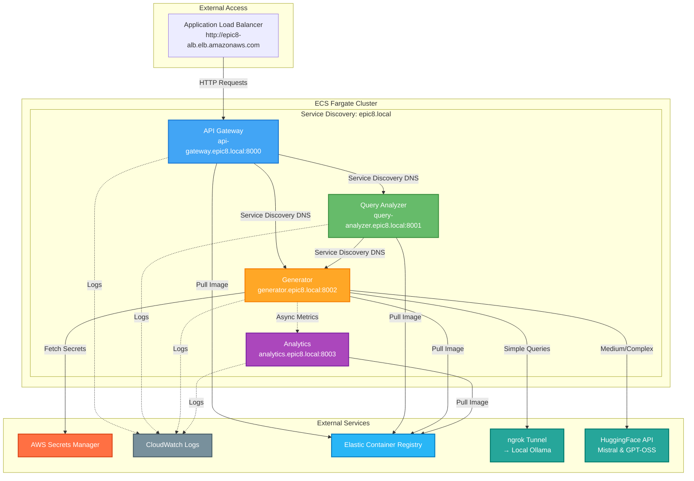

**Communication Patterns:**
- **ALB → API Gateway**: External traffic entry point via HTTP
- **Service Discovery**: Internal DNS (epic8.local) resolves service names to IPs
- **Synchronous**: API Gateway → Query Analyzer → Generator (request/response)
- **Asynchronous**: Generator → Analytics (fire-and-forget metrics)
- **External Dependencies**: Secrets Manager (config), ECR (images), CloudWatch (logs)
- **Model Access**: Generator reaches external models via ngrok and HuggingFace API

### 2.1 Build and Push Docker Images

```bash
# Navigate to project directory
cd /path/to/rag-portfolio/project-1-technical-rag

# Source infrastructure IDs
source infrastructure-ids.sh

# ECR login
aws ecr get-login-password --region $AWS_REGION | \
  docker login --username AWS --password-stdin \
  $AWS_ACCOUNT_ID.dkr.ecr.$AWS_REGION.amazonaws.com

# Build and push API Gateway
docker build -t epic8/api-gateway -f services/api_gateway/Dockerfile .
docker tag epic8/api-gateway:latest \
  $AWS_ACCOUNT_ID.dkr.ecr.$AWS_REGION.amazonaws.com/epic8/api-gateway:latest
docker push $AWS_ACCOUNT_ID.dkr.ecr.$AWS_REGION.amazonaws.com/epic8/api-gateway:latest

# Build and push Query Analyzer
docker build -t epic8/query-analyzer -f services/query_analyzer/Dockerfile .
docker tag epic8/query-analyzer:latest \
  $AWS_ACCOUNT_ID.dkr.ecr.$AWS_REGION.amazonaws.com/epic8/query-analyzer:latest
docker push $AWS_ACCOUNT_ID.dkr.ecr.$AWS_REGION.amazonaws.com/epic8/query-analyzer:latest

# Build and push Generator
docker build -t epic8/generator -f services/generator/Dockerfile .
docker tag epic8/generator:latest \
  $AWS_ACCOUNT_ID.dkr.ecr.$AWS_REGION.amazonaws.com/epic8/generator:latest
docker push $AWS_ACCOUNT_ID.dkr.ecr.$AWS_REGION.amazonaws.com/epic8/generator:latest

# Build and push Analytics
docker build -t epic8/analytics -f services/analytics/Dockerfile .
docker tag epic8/analytics:latest \
  $AWS_ACCOUNT_ID.dkr.ecr.$AWS_REGION.amazonaws.com/epic8/analytics:latest
docker push $AWS_ACCOUNT_ID.dkr.ecr.$AWS_REGION.amazonaws.com/epic8/analytics:latest

echo "All images pushed to ECR successfully!"
```

### 2.2 Create ECS Task Definitions

**Generator Service Task Definition** (most important):

```bash
cat > generator-task-definition.json <<EOF
{
  "family": "epic8-generator",
  "networkMode": "awsvpc",
  "requiresCompatibilities": ["FARGATE"],
  "cpu": "256",
  "memory": "512",
  "executionRoleArn": "$TASK_EXECUTION_ROLE_ARN",
  "taskRoleArn": "$TASK_ROLE_ARN",
  "containerDefinitions": [
    {
      "name": "generator",
      "image": "$AWS_ACCOUNT_ID.dkr.ecr.$AWS_REGION.amazonaws.com/epic8/generator:latest",
      "essential": true,
      "portMappings": [
        {
          "containerPort": 8002,
          "protocol": "tcp"
        }
      ],
      "environment": [
        {"name": "SERVICE_NAME", "value": "generator"},
        {"name": "PORT", "value": "8002"},
        {"name": "LOG_LEVEL", "value": "INFO"},
        {"name": "AWS_REGION", "value": "$AWS_REGION"}
      ],
      "secrets": [
        {
          "name": "HUGGINGFACE_TOKEN",
          "valueFrom": "arn:aws:secretsmanager:$AWS_REGION:$AWS_ACCOUNT_ID:secret:epic8/huggingface-token"
        },
        {
          "name": "OLLAMA_URL",
          "valueFrom": "arn:aws:secretsmanager:$AWS_REGION:$AWS_ACCOUNT_ID:secret:epic8/ollama-url"
        }
      ],
      "logConfiguration": {
        "logDriver": "awslogs",
        "options": {
          "awslogs-group": "/ecs/epic8-generator",
          "awslogs-region": "$AWS_REGION",
          "awslogs-stream-prefix": "ecs"
        }
      },
      "healthCheck": {
        "command": ["CMD-SHELL", "curl -f http://localhost:8002/health || exit 1"],
        "interval": 30,
        "timeout": 5,
        "retries": 3,
        "startPeriod": 60
      }
    }
  ]
}
EOF

# Register task definition
aws ecs register-task-definition --cli-input-json file://generator-task-definition.json
```

**Create task definitions for other services** (API Gateway, Query Analyzer, Analytics):

```bash
# API Gateway
cat > api-gateway-task-definition.json <<EOF
{
  "family": "epic8-api-gateway",
  "networkMode": "awsvpc",
  "requiresCompatibilities": ["FARGATE"],
  "cpu": "256",
  "memory": "512",
  "executionRoleArn": "$TASK_EXECUTION_ROLE_ARN",
  "taskRoleArn": "$TASK_ROLE_ARN",
  "containerDefinitions": [
    {
      "name": "api-gateway",
      "image": "$AWS_ACCOUNT_ID.dkr.ecr.$AWS_REGION.amazonaws.com/epic8/api-gateway:latest",
      "essential": true,
      "portMappings": [{"containerPort": 8000, "protocol": "tcp"}],
      "environment": [
        {"name": "SERVICE_NAME", "value": "api-gateway"},
        {"name": "PORT", "value": "8000"},
        {"name": "QUERY_ANALYZER_URL", "value": "http://query-analyzer.epic8.local:8001"},
        {"name": "GENERATOR_URL", "value": "http://generator.epic8.local:8002"}
      ],
      "logConfiguration": {
        "logDriver": "awslogs",
        "options": {
          "awslogs-group": "/ecs/epic8-api-gateway",
          "awslogs-region": "$AWS_REGION",
          "awslogs-stream-prefix": "ecs"
        }
      },
      "healthCheck": {
        "command": ["CMD-SHELL", "curl -f http://localhost:8000/health || exit 1"],
        "interval": 30,
        "timeout": 5,
        "retries": 3
      }
    }
  ]
}
EOF

aws ecs register-task-definition --cli-input-json file://api-gateway-task-definition.json
```

### 2.3 Create Secrets in AWS Secrets Manager

```bash
# Store HuggingFace token
aws secretsmanager create-secret \
  --name epic8/huggingface-token \
  --description "HuggingFace API token for Epic8" \
  --secret-string "$HUGGINGFACE_TOKEN"

# Store Ollama URL (update this with your ngrok URL)
read -p "Enter your ngrok URL (e.g., https://xxxx.ngrok-free.app): " OLLAMA_URL
aws secretsmanager create-secret \
  --name epic8/ollama-url \
  --description "Ollama tunnel URL for Epic8" \
  --secret-string "$OLLAMA_URL"

echo "Secrets created successfully!"
```

### 2.4 Create CloudWatch Log Groups

```bash
# Create log groups for all services
for service in api-gateway query-analyzer generator analytics; do
  aws logs create-log-group \
    --log-group-name /ecs/epic8-$service \
    --region $AWS_REGION

  # Set retention to 7 days to save costs
  aws logs put-retention-policy \
    --log-group-name /ecs/epic8-$service \
    --retention-in-days 7
done

echo "CloudWatch log groups created!"
```

### 2.5 Create ECS Services

**Create Service Discovery Namespace** (for service-to-service communication):

```bash
# Create Cloud Map namespace
NAMESPACE_ID=$(aws servicediscovery create-private-dns-namespace \
  --name epic8.local \
  --vpc $VPC_ID \
  --query 'OperationId' \
  --output text)

# Wait for namespace creation
sleep 10

# Get namespace ID
NAMESPACE_ID=$(aws servicediscovery list-namespaces \
  --query "Namespaces[?Name=='epic8.local'].Id" \
  --output text)

echo "Namespace ID: $NAMESPACE_ID"
```

**Deploy Generator Service**:

```bash
aws ecs create-service \
  --cluster epic8-ecs-cluster \
  --service-name generator \
  --task-definition epic8-generator \
  --desired-count 1 \
  --launch-type FARGATE \
  --network-configuration "awsvpcConfiguration={subnets=[$SUBNET_ID],securityGroups=[$SG_ID],assignPublicIp=ENABLED}" \
  --service-registries "registryArn=$(aws servicediscovery create-service \
      --name generator \
      --dns-config 'NamespaceId=$NAMESPACE_ID,DnsRecords=[{Type=A,TTL=60}]' \
      --health-check-custom-config FailureThreshold=1 \
      --query 'Service.Arn' --output text)"

echo "Generator service deployed!"
```

**Deploy API Gateway Service** (with ALB):

```bash
aws ecs create-service \
  --cluster epic8-ecs-cluster \
  --service-name api-gateway \
  --task-definition epic8-api-gateway \
  --desired-count 1 \
  --launch-type FARGATE \
  --network-configuration "awsvpcConfiguration={subnets=[$SUBNET_ID],securityGroups=[$SG_ID],assignPublicIp=ENABLED}" \
  --load-balancers "targetGroupArn=$TG_ARN,containerName=api-gateway,containerPort=8000"

echo "API Gateway service deployed!"
echo "Access your API at: http://$ALB_DNS"
```

---

## Phase 3: Model Configuration

### 3.1 Configure Epic 1 Routing

**Update Generator Service Configuration**:

The configuration file `config/epic1_ecs_deployment.yaml` (created earlier) needs to be baked into the Docker image or mounted as a volume.

**Option A: Bake into Docker Image** (Recommended):

```dockerfile
# In services/generator/Dockerfile
COPY config/epic1_ecs_deployment.yaml /app/config/epic1_ecs_deployment.yaml
ENV CONFIG_PATH=/app/config/epic1_ecs_deployment.yaml
```

Rebuild and push:
```bash
docker build -t epic8/generator -f services/generator/Dockerfile .
docker tag epic8/generator:latest \
  $AWS_ACCOUNT_ID.dkr.ecr.$AWS_REGION.amazonaws.com/epic8/generator:latest
docker push $AWS_ACCOUNT_ID.dkr.ecr.$AWS_REGION.amazonaws.com/epic8/generator:latest

# Update ECS service to use new image
aws ecs update-service \
  --cluster epic8-ecs-cluster \
  --service generator \
  --force-new-deployment
```

### 3.2 Test Model Endpoints

**Test Ollama via ngrok**:

```bash
# From your Mac
curl $OLLAMA_URL/api/generate \
  -d '{"model": "llama3.2:3b", "prompt": "What is AI?", "stream": false}'
```

**Test HuggingFace API - Mistral**:

```bash
curl -H "Authorization: Bearer $HUGGINGFACE_TOKEN" \
     -H "Content-Type: application/json" \
     -d '{"inputs": "What is machine learning?", "parameters": {"max_new_tokens": 100}}' \
     https://api-inference.huggingface.co/models/mistralai/Mistral-7B-Instruct-v0.2
```

**Test HuggingFace API - GPT-OSS**:

```bash
curl -H "Authorization: Bearer $HUGGINGFACE_TOKEN" \
     -H "Content-Type: application/json" \
     -d '{"inputs": "Explain quantum entanglement in detail", "parameters": {"max_new_tokens": 200}}' \
     https://api-inference.huggingface.co/models/openai/gpt-oss-20b
```

### 3.3 Verify Routing Configuration

**Check Generator Service Logs**:

```bash
# Get task ARN
TASK_ARN=$(aws ecs list-tasks \
  --cluster epic8-ecs-cluster \
  --service-name generator \
  --query 'taskArns[0]' \
  --output text)

# View logs
aws logs tail /ecs/epic8-generator --follow
```

Look for log messages indicating model configuration:
```
INFO: Loaded 3 models: simple, medium, complex
INFO: Routing strategy: complexity_based
INFO: Thresholds: simple_max=2.9, medium_max=6.9, complex_min=7.0
```

---

## Phase 4: Testing & Validation

### 4.1 Health Check Testing

#### Health Check Flow

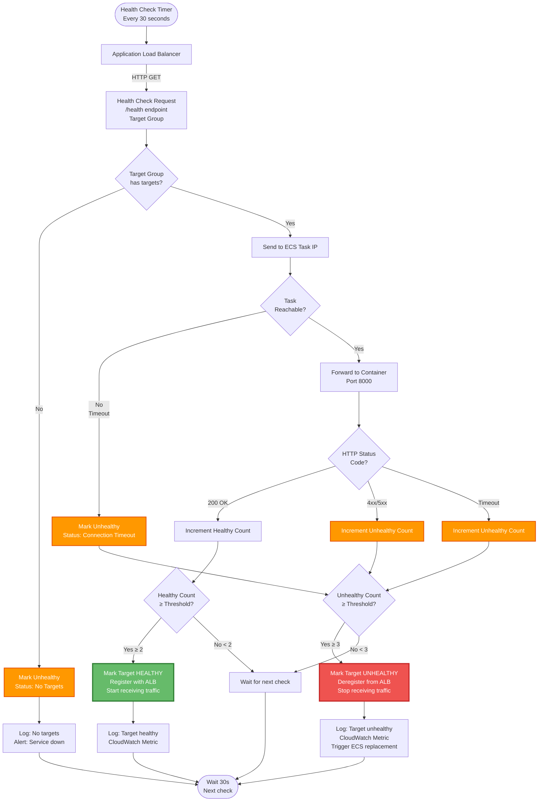

**Health Check Parameters:**
- **Interval**: 30 seconds (how often to check)
- **Timeout**: 5 seconds (max wait for response)
- **Healthy Threshold**: 2 (consecutive successes to mark healthy)
- **Unhealthy Threshold**: 3 (consecutive failures to mark unhealthy)
- **Grace Period**: 120 seconds (initial delay before first check)

**Troubleshooting:**
- **Stuck Unhealthy**: Check `/health` endpoint manually, review app logs
- **Flapping (Healthy/Unhealthy)**: App may be slow to start, increase grace period
- **No Targets**: Service scaled to 0 or all tasks failed, check ECS service events

#### Test Health Endpoints

```bash
# Check all service health endpoints
echo "API Gateway Health:"
curl http://$ALB_DNS/health

echo -e "\nGenerator Health (via ALB):"
curl http://$ALB_DNS/api/v1/generator/health

echo -e "\nQuery Analyzer Health:"
# Note: Query Analyzer not exposed via ALB, check via ECS logs
aws logs tail /ecs/epic8-query-analyzer --since 1m
```

### 4.2 End-to-End Query Testing

**Test Simple Query** (should use Ollama):

```bash
curl -X POST http://$ALB_DNS/api/v1/query \
  -H "Content-Type: application/json" \
  -d '{
    "query": "What is AI?",
    "context": ["AI stands for Artificial Intelligence."]
  }'

# Expected response:
# {
#   "answer": "...",
#   "model_used": "ollama/llama3.2:3b",
#   "complexity_score": 1.2,
#   "latency_ms": 500
# }
```

**Test Medium Query** (should use Mistral):

```bash
curl -X POST http://$ALB_DNS/api/v1/query \
  -H "Content-Type: application/json" \
  -d '{
    "query": "Explain machine learning algorithms and their applications",
    "context": ["Machine learning is a subset of AI..."]
  }'

# Expected response:
# {
#   "answer": "...",
#   "model_used": "huggingface/mistralai/Mistral-7B-Instruct-v0.2",
#   "complexity_score": 4.5,
#   "latency_ms": 1500
# }
```

**Test Complex Query** (should use GPT-OSS):

```bash
curl -X POST http://$ALB_DNS/api/v1/query \
  -H "Content-Type: application/json" \
  -d '{
    "query": "Provide a comprehensive analysis of quantum computing architectures, including superconducting qubits, trapped ions, and topological qubits, with their respective advantages and limitations",
    "context": ["Quantum computing uses quantum bits..."]
  }'

# Expected response:
# {
#   "answer": "...",
#   "model_used": "huggingface/openai/gpt-oss-20b",
#   "complexity_score": 8.7,
#   "latency_ms": 3500
# }
```

### 4.3 Load Testing

**Install hey (HTTP load testing tool)**:

```bash
brew install hey
```

**Run load test**:

```bash
# Test with 100 requests, 10 concurrent
hey -n 100 -c 10 -m POST \
  -H "Content-Type: application/json" \
  -d '{"query": "What is AI?", "context": ["AI is..."]}' \
  http://$ALB_DNS/api/v1/query

# Expected results:
# - Total time: ~50 seconds
# - Requests/sec: ~2 req/sec
# - 95th percentile latency: <2s
```

### 4.4 Model Distribution Validation

**Check CloudWatch Metrics**:

```bash
# Get model usage counts from logs
aws logs filter-log-events \
  --log-group-name /ecs/epic8-generator \
  --start-time $(date -u -d '1 hour ago' +%s)000 \
  --filter-pattern "model_used" \
  --query 'events[].message' \
  --output text | \
  grep -oP 'model_used":\s*"\K[^"]+' | \
  sort | uniq -c

# Expected distribution (after 100+ queries):
# ~60 ollama/llama3.2:3b
# ~30 mistralai/Mistral-7B-Instruct-v0.2
# ~10 openai/gpt-oss-20b
```

---

## Phase 5: Monitoring & Cost Control

### 5.1 CloudWatch Dashboard Setup

#### Expected Model Distribution

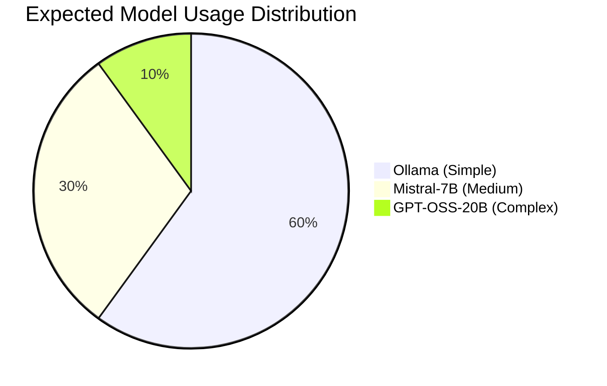

**Distribution Analysis:**

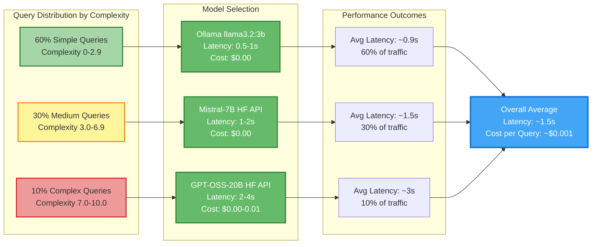

**Validation Metrics:**
- **Model Usage Ratio**: Should be approximately 6:3:1 (Ollama:Mistral:GPT-OSS)
- **Average Latency**: Should be ~1.5 seconds across all queries
- **Cost per Query**: Should be ~$0.001 (infrastructure only, models are free)
- **Deviation Alert**: If any model exceeds 70% usage, review complexity thresholds

**Create Custom Dashboard**:

```bash
cat > dashboard.json <<'EOF'
{
  "widgets": [
    {
      "type": "metric",
      "properties": {
        "metrics": [
          ["AWS/ECS", "CPUUtilization", {"stat": "Average"}],
          [".", "MemoryUtilization", {"stat": "Average"}]
        ],
        "period": 300,
        "stat": "Average",
        "region": "us-east-1",
        "title": "ECS Resource Utilization"
      }
    },
    {
      "type": "log",
      "properties": {
        "query": "SOURCE '/ecs/epic8-generator'\n| fields @timestamp, model_used, latency_ms\n| stats count() by model_used",
        "region": "us-east-1",
        "title": "Model Usage Distribution"
      }
    }
  ]
}
EOF

aws cloudwatch put-dashboard \
  --dashboard-name Epic8-Monitoring \
  --dashboard-body file://dashboard.json
```

**Access Dashboard**:
```
https://console.aws.amazon.com/cloudwatch/home?region=us-east-1#dashboards:name=Epic8-Monitoring
```

### 5.2 Cost Tracking

**Set Up Billing Alarm**:

```bash
# Create SNS topic for alerts
TOPIC_ARN=$(aws sns create-topic \
  --name epic8-billing-alerts \
  --query 'TopicArn' \
  --output text)

# Subscribe your email
aws sns subscribe \
  --topic-arn $TOPIC_ARN \
  --protocol email \
  --notification-endpoint your-email@example.com

# Create billing alarm (alert at $80 spent)
aws cloudwatch put-metric-alarm \
  --alarm-name epic8-budget-80pct \
  --alarm-description "Alert when Epic8 spending reaches $80" \
  --metric-name EstimatedCharges \
  --namespace AWS/Billing \
  --statistic Maximum \
  --period 21600 \
  --evaluation-periods 1 \
  --threshold 80 \
  --comparison-operator GreaterThanThreshold \
  --alarm-actions $TOPIC_ARN \
  --dimensions Name=Currency,Value=USD
```

**Daily Cost Tracking Script**:

```bash
cat > check-costs.sh <<'EOF'
#!/bin/bash

# Get current month costs
START_DATE=$(date -u +%Y-%m-01)
END_DATE=$(date -u +%Y-%m-%d)

aws ce get-cost-and-usage \
  --time-period Start=$START_DATE,End=$END_DATE \
  --granularity DAILY \
  --metrics "UnblendedCost" \
  --group-by Type=SERVICE \
  --filter file://<(echo '{
    "Tags": {
      "Key": "Project",
      "Values": ["epic8"]
    }
  }') \
  --query 'ResultsByTime[-1].Groups[].{Service:Keys[0],Cost:Metrics.UnblendedCost.Amount}' \
  --output table

echo ""
echo "Total spent this month:"
aws ce get-cost-and-usage \
  --time-period Start=$START_DATE,End=$END_DATE \
  --granularity MONTHLY \
  --metrics "UnblendedCost" \
  --query 'ResultsByTime[0].Total.UnblendedCost.Amount' \
  --output text

echo ""
echo "Days remaining with $100 budget (at $3.20/day):"
SPENT=$(aws ce get-cost-and-usage \
  --time-period Start=$START_DATE,End=$END_DATE \
  --granularity MONTHLY \
  --metrics "UnblendedCost" \
  --query 'ResultsByTime[0].Total.UnblendedCost.Amount' \
  --output text)

REMAINING=$(echo "100 - $SPENT" | bc)
DAYS=$(echo "$REMAINING / 3.2" | bc)
echo "$DAYS days"
EOF

chmod +x check-costs.sh
./check-costs.sh
```

### 5.3 Auto-Shutdown (Optional)

**For Work Hours Only Operation**:

```bash
cat > schedule-services.sh <<'EOF'
#!/bin/bash

# Stop services at 6 PM EST (scale to 0)
aws ecs update-service \
  --cluster epic8-ecs-cluster \
  --service api-gateway \
  --desired-count 0

aws ecs update-service \
  --cluster epic8-ecs-cluster \
  --service generator \
  --desired-count 0

# ... repeat for other services
EOF

# Schedule with cron (on your Mac or EC2 scheduler)
# Stop at 6 PM: 0 18 * * * /path/to/schedule-services.sh stop
# Start at 8 AM: 0 8 * * * /path/to/schedule-services.sh start
```

### 5.4 Logging Best Practices

**View Real-Time Logs**:

```bash
# Generator logs (most important)
aws logs tail /ecs/epic8-generator --follow --since 1h

# Filter for routing decisions
aws logs tail /ecs/epic8-generator --follow \
  --filter-pattern "complexity_score"

# Filter for errors
aws logs tail /ecs/epic8-generator --follow \
  --filter-pattern "ERROR"
```

**Export Logs for Analysis**:

```bash
# Export last 24 hours to S3
aws logs create-export-task \
  --log-group-name /ecs/epic8-generator \
  --from $(date -u -d '24 hours ago' +%s)000 \
  --to $(date -u +%s)000 \
  --destination your-bucket-name \
  --destination-prefix epic8/logs/
```

---

## Deployment Checklist

### Pre-Deployment

- [ ] AWS CLI configured and authenticated
- [ ] Docker Desktop running
- [ ] HuggingFace token obtained and tested
- [ ] Ollama running locally (`ollama serve`)
- [ ] ngrok tunnel active and URL noted
- [ ] $100 AWS credit confirmed in account

### Infrastructure Setup

- [ ] VPC and subnet created
- [ ] Internet Gateway attached
- [ ] Security groups configured
- [ ] ECS cluster created
- [ ] ECR repositories created
- [ ] IAM roles created (execution + task roles)
- [ ] Application Load Balancer created
- [ ] Target groups configured
- [ ] CloudWatch log groups created
- [ ] Service Discovery namespace created

### Service Deployment

- [ ] All Docker images built
- [ ] All images pushed to ECR
- [ ] Secrets stored in Secrets Manager
- [ ] Task definitions registered
- [ ] ECS services created and running
- [ ] Load balancer health checks passing

### Model Configuration

- [ ] Epic 1 routing configuration deployed
- [ ] Ollama endpoint accessible via ngrok
- [ ] HuggingFace API Mistral tested
- [ ] HuggingFace API GPT-OSS tested
- [ ] Environment variables set correctly

### Testing

- [ ] Health endpoints responding
- [ ] Simple query returns Ollama response
- [ ] Medium query returns Mistral response
- [ ] Complex query returns GPT-OSS response
- [ ] Model distribution matches expected (~60/30/10)
- [ ] Response times acceptable (<2s for 95%)
- [ ] Load test completed successfully

### Monitoring

- [ ] CloudWatch dashboard created
- [ ] Billing alarm configured ($80 threshold)
- [ ] Email notifications subscribed
- [ ] Cost tracking script running daily
- [ ] Logs accessible and searchable

### Documentation

- [ ] Infrastructure IDs saved (`infrastructure-ids.sh`)
- [ ] ALB DNS noted for API access
- [ ] Demo scripts prepared
- [ ] Troubleshooting guide reviewed

---

## Troubleshooting

### ECS Task Lifecycle

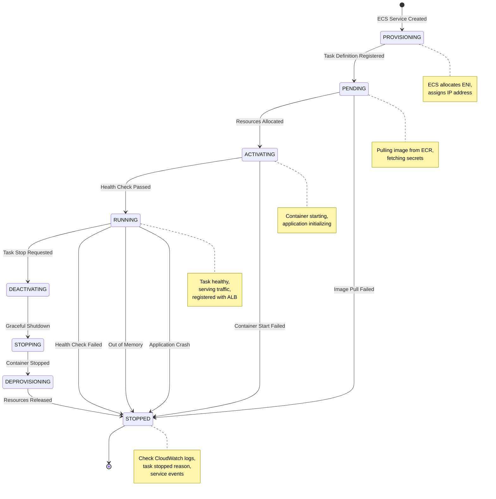

**Common State Transitions:**
- **Normal Flow**: PROVISIONING → PENDING → ACTIVATING → RUNNING → DEACTIVATING → STOPPING → STOPPED
- **Image Pull Failure**: PENDING → STOPPED (check ECR permissions)
- **Container Start Failure**: ACTIVATING → STOPPED (check logs, application errors)
- **Health Check Failure**: RUNNING → STOPPED (check /health endpoint, ALB target group)
- **Application Crash**: RUNNING → STOPPED (check CloudWatch logs for errors)

**Troubleshooting by State:**
- **Stuck in PENDING**: Image pull issues, secrets access denied
- **Stuck in ACTIVATING**: Container startup errors, port conflicts
- **RUNNING → STOPPED (loop)**: Health checks failing repeatedly
- **Immediate STOPPED**: Task definition errors, resource constraints

### Issue: Tasks Failing to Start

**Symptoms**: ECS service shows tasks in "PENDING" or "STOPPED" state

**Diagnosis**:
```bash
# Check service events
aws ecs describe-services \
  --cluster epic8-ecs-cluster \
  --services generator \
  --query 'services[0].events[0:5]'

# Check task stopped reason
aws ecs describe-tasks \
  --cluster epic8-ecs-cluster \
  --tasks <task-id> \
  --query 'tasks[0].stoppedReason'
```

**Common Causes**:
1. **Insufficient CPU/Memory**: Increase task definition resources
2. **Image Pull Errors**: Check ECR permissions and image exists
3. **Health Check Failures**: Check application logs and `/health` endpoint
4. **Secret Access Denied**: Verify task execution role has `secretsmanager:GetSecretValue`

**Fix**:
```bash
# For secret access issues, add policy to execution role
aws iam put-role-policy \
  --role-name ecsTaskExecutionRole \
  --policy-name SecretsManagerAccess \
  --policy-document '{
    "Version": "2012-10-17",
    "Statement": [{
      "Effect": "Allow",
      "Action": ["secretsmanager:GetSecretValue"],
      "Resource": "arn:aws:secretsmanager:us-east-1:*:secret:epic8/*"
    }]
  }'
```

### Issue: Model Selection Not Working

**Symptoms**: All queries use same model regardless of complexity

**Diagnosis**:
```bash
# Check generator logs for routing decisions
aws logs tail /ecs/epic8-generator --since 10m \
  --filter-pattern "complexity_score"
```

**Common Causes**:
1. **Configuration Not Loaded**: Config file missing or invalid path
2. **Environment Variables Wrong**: OLLAMA_URL or HUGGINGFACE_TOKEN incorrect
3. **Adapter Initialization Failed**: Check adapter error logs

**Fix**:
```bash
# Verify secrets are accessible
aws ecs describe-tasks \
  --cluster epic8-ecs-cluster \
  --tasks <task-arn> \
  --include SECRETS

# Force new deployment with updated config
aws ecs update-service \
  --cluster epic8-ecs-cluster \
  --service generator \
  --force-new-deployment
```

### Issue: Ollama Connection Timeout

**Symptoms**: Simple queries fail with "Connection refused" or timeout

**Diagnosis**:
```bash
# Test ngrok tunnel from ECS task
aws ecs execute-command \
  --cluster epic8-ecs-cluster \
  --task <task-arn> \
  --container generator \
  --interactive \
  --command "curl $OLLAMA_URL/api/version"
```

**Common Causes**:
1. **ngrok Tunnel Closed**: ngrok needs to stay running
2. **Wrong URL**: Environment variable has old ngrok URL
3. **Firewall/Network**: ngrok free tier may have rate limits

**Fix**:
```bash
# Update Ollama URL secret
aws secretsmanager update-secret \
  --secret-id epic8/ollama-url \
  --secret-string "https://new-ngrok-url.ngrok-free.app"

# Restart generator service
aws ecs update-service \
  --cluster epic8-ecs-cluster \
  --service generator \
  --force-new-deployment
```

### Issue: HuggingFace API Rate Limits

**Symptoms**: "Rate limit exceeded" errors for medium/complex queries

**Diagnosis**:
```bash
# Check HuggingFace API response headers
curl -I -H "Authorization: Bearer $HUGGINGFACE_TOKEN" \
  https://api-inference.huggingface.co/models/mistralai/Mistral-7B-Instruct-v0.2

# Look for: X-RateLimit-Remaining
```

**Common Causes**:
1. **Free Tier Limits**: HF free tier has rate limits
2. **Token Not Active**: Subscription tokens not used
3. **Model Loading**: Cold start can take 20s on first request

**Fix**:
```bash
# Implement retry logic in adapter (already in HuggingFaceAdapter)
# Or add request caching to reduce API calls

# For production, consider:
# - Upgrade HF subscription
# - Implement response caching
# - Add fallback to cheaper models
```

### Issue: High Costs / Budget Running Out

**Symptoms**: Costs exceed $3.20/day, budget depleting faster than 31 days

**Diagnosis**:
```bash
# Check current spend
./check-costs.sh

# Identify cost drivers
aws ce get-cost-and-usage \
  --time-period Start=2025-11-01,End=2025-11-10 \
  --granularity DAILY \
  --metrics "UnblendedCost" \
  --group-by Type=SERVICE
```

**Common Causes**:
1. **Data Transfer**: Heavy API usage causing outbound data charges
2. **ALB**: More traffic than estimated
3. **CloudWatch Logs**: High log volume (check retention policy)
4. **Task Sizes**: Tasks using more CPU/memory than needed

**Fix**:
```bash
# Reduce task sizes
aws ecs update-task-definition \
  --family epic8-generator \
  --cpu 128 \
  --memory 256

# Implement work hours schedule
# Stop services overnight to save ~70%

# Reduce log retention
aws logs put-retention-policy \
  --log-group-name /ecs/epic8-generator \
  --retention-in-days 3
```

### Issue: ALB Health Checks Failing

**Symptoms**: Target group shows "unhealthy" targets, 502 errors from ALB

**Diagnosis**:
```bash
# Check target health
aws elbv2 describe-target-health \
  --target-group-arn $TG_ARN

# Check task logs
aws logs tail /ecs/epic8-api-gateway --since 5m
```

**Common Causes**:
1. **Wrong Health Check Path**: `/health` not implemented
2. **Slow Startup**: Task not ready within health check grace period
3. **Port Mismatch**: Container port ≠ target group port

**Fix**:
```bash
# Increase health check grace period
aws ecs update-service \
  --cluster epic8-ecs-cluster \
  --service api-gateway \
  --health-check-grace-period-seconds 120

# Verify health endpoint
curl http://<task-public-ip>:8000/health
```

---

## Next Steps

### After Successful Deployment

1. **Demo Preparation**:
   - Prepare sample queries (simple, medium, complex)
   - Test all three model tiers
   - Document response times and model selections
   - Take screenshots of CloudWatch metrics

2. **Portfolio Documentation**:
   - Update your portfolio with deployment architecture
   - Include cost optimization strategies
   - Showcase Epic 1 adaptive routing in production
   - Document lessons learned

3. **Optional Enhancements**:
   - Add Retriever service for full RAG pipeline
   - Implement Redis caching for frequent queries
   - Set up CI/CD pipeline for automated deployments
   - Add custom domain with Route 53

### Cost Optimization Strategies

**If Budget Running Low**:
1. Switch to work hours only (8am-6pm) → Save 70%
2. Remove Analytics service → Save $0.62/day
3. Reduce all tasks to 0.25 vCPU → Save $0.39/day
4. Use AWS Free Tier alternatives where possible

**If Want to Extend Past 31 Days**:
1. Consider AWS Educate credits
2. Use LocalStack for local AWS emulation
3. Document working system and tear down
4. Rebuild when needed for demos

### Production Readiness

For real production deployment (beyond demo):
1. **Migrate to EKS** for full Kubernetes features
2. **Add GPU node group** for self-hosted GPT-OSS
3. **Implement caching** (Redis + response cache)
4. **Add monitoring** (Prometheus + Grafana)
5. **Enable auto-scaling** based on load
6. **Set up CI/CD** (GitHub Actions → ECR → ECS)

---

## Appendix

### A. Useful AWS CLI Commands

```bash
# List all running tasks
aws ecs list-tasks --cluster epic8-ecs-cluster

# Describe specific task
aws ecs describe-tasks --cluster epic8-ecs-cluster --tasks <task-arn>

# View service details
aws ecs describe-services --cluster epic8-ecs-cluster --services generator

# Force new deployment (after config changes)
aws ecs update-service --cluster epic8-ecs-cluster --service generator --force-new-deployment

# Scale service
aws ecs update-service --cluster epic8-ecs-cluster --service generator --desired-count 2

# Stop all services (save costs)
for svc in api-gateway query-analyzer generator analytics; do
  aws ecs update-service --cluster epic8-ecs-cluster --service $svc --desired-count 0
done

# View logs
aws logs tail /ecs/epic8-generator --follow --since 1h

# Check costs
aws ce get-cost-and-usage \
  --time-period Start=2025-11-01,End=2025-11-10 \
  --granularity DAILY \
  --metrics "UnblendedCost"
```

### B. Environment Variables Reference

```bash
# Required for all services
SERVICE_NAME=<service-name>
PORT=<service-port>
LOG_LEVEL=INFO
AWS_REGION=us-east-1
ENVIRONMENT=production

# Generator service specific
HUGGINGFACE_TOKEN=hf_xxxxxxxxxxxxx  # From Secrets Manager
OLLAMA_URL=https://xxxx.ngrok-free.app  # From Secrets Manager
CONFIG_PATH=/app/config/epic1_ecs_deployment.yaml

# API Gateway specific
QUERY_ANALYZER_URL=http://query-analyzer.epic8.local:8001
GENERATOR_URL=http://generator.epic8.local:8002
RETRIEVER_URL=http://retriever.epic8.local:8004  # Optional
```

### C. Cost Breakdown Detail

```
ECS Fargate Pricing (us-east-1):
─────────────────────────────────
CPU: $0.04048 per vCPU-hour
Memory: $0.004445 per GB-hour

Example: 0.25 vCPU, 0.5 GB for 24 hours
CPU cost: 0.25 * $0.04048 * 24 = $0.24/day
Memory cost: 0.5 * $0.004445 * 24 = $0.05/day
Total per task: $0.29/day

Application Load Balancer:
─────────────────────────
ALB-hour: $0.0225 per hour = $0.54/day
LCU (minimal usage): ~$0.008/day
Total ALB: $0.55/day

Data Transfer:
──────────────
First 1 GB/month: FREE
$0.09 per GB after that
Expected: ~$0.10/day for demo usage

Total Daily Cost:
─────────────────
4 tasks × $0.29 = $1.16/day
ALB = $0.55/day
Data = $0.10/day
──────────────────────────
Total: $1.81/day (optimistic)

With overhead and actual usage:
~$3.20/day (realistic estimate)
```

---

**Status**: READY FOR DEPLOYMENT ✅

**Next Step**: Start with [Phase 1: Infrastructure Setup](#phase-1-infrastructure-setup)

**Questions?** Review the [Troubleshooting](#troubleshooting) section or check AWS documentation.

**Budget Tracking**: Run `./check-costs.sh` daily to monitor spending.

**Demo Access**: Once deployed, access your API at `http://<ALB-DNS>/health`
