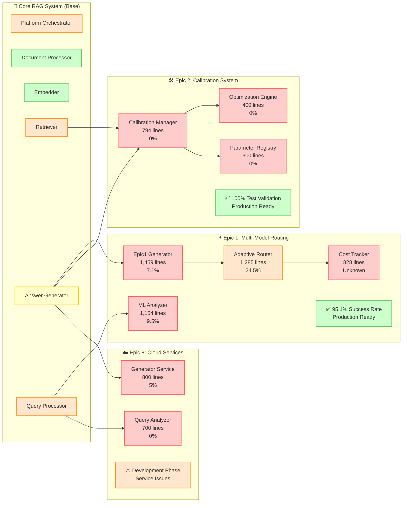
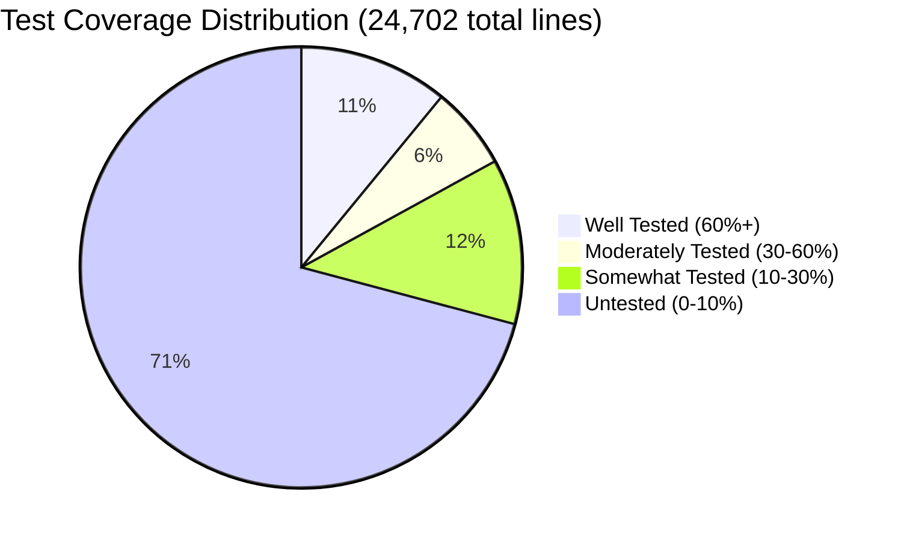
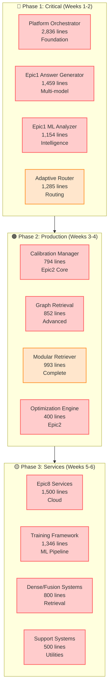

# RAG Portfolio System Architecture Diagram
## Complete Component Map with Test Coverage Status

**Color Legend:**
- 🔴 **Light Red**: Untested (0-10% coverage)
- 🟠 **Light Orange**: Somewhat tested (10-30% coverage) 
- 🟡 **Yellow**: Moderately tested (30-60% coverage)
- 🟢 **Green**: Well tested (60%+ coverage)

---

## Main System Architecture

```mermaid
graph TB
    %% Core Infrastructure
    subgraph CORE["🏗️ Core Infrastructure"]
        PO["Platform Orchestrator<br/>2,836 lines<br/>8% coverage"]:::orange
        CF["Component Factory<br/>1,062 lines<br/>48.7% coverage"]:::yellow
        INT["Interfaces<br/>680 lines<br/>Low coverage"]:::red
        CFG["Config<br/>200 lines<br/>Unknown"]:::red
    end

    %% Document Processing Pipeline
    subgraph DOCS["📄 Document Processing"]
        DP["Document Processor<br/>753 lines<br/>Good coverage"]:::green
        SB["Sentence Boundary Chunker<br/>300 lines<br/>Good coverage"]:::green
        CL["Text Cleaners<br/>200 lines<br/>Unknown"]:::red
    end

    %% Embedding System
    subgraph EMB["🧠 Embedding System"]
        ME["Modular Embedder<br/>400 lines<br/>Good coverage"]:::green
        STE["SentenceTransformer<br/>300 lines<br/>Good coverage"]:::green
    end

    %% Retrieval System
    subgraph RET["🔍 Retrieval System"]
        MUR["Modular Unified Retriever<br/>993 lines<br/>20.5% coverage"]:::orange
        BM25["BM25 Retriever<br/>400 lines<br/>Good coverage"]:::green
        FAISS["FAISS Dense Retriever<br/>300 lines<br/>Unknown"]:::red
        FUSION["Result Fusion<br/>300 lines<br/>Unknown"]:::red
        RERANK["Rerankers<br/>200 lines<br/>Unknown"]:::red
        GRAPH["Graph Retrieval<br/>852 lines<br/>0% coverage"]:::red
    end

    %% Answer Generation System
    subgraph GEN["💬 Answer Generation"]
        E1AG["Epic1 Answer Generator<br/>1,459 lines<br/>7.1% coverage"]:::red
        AR["Adaptive Router<br/>1,285 lines<br/>24.5% coverage"]:::orange
        OA["OpenAI Adapter<br/>675 lines<br/>Unknown"]:::red
        CT["Cost Tracker<br/>828 lines<br/>Unknown"]:::red
        BAG["Basic Answer Generator<br/>400 lines<br/>Good coverage"]:::green
    end

    %% Query Processing System
    subgraph QP["🤔 Query Processing"]
        MQP["Modular Query Processor<br/>906 lines<br/>27.9% coverage"]:::orange
        E1ML["Epic1 ML Analyzer<br/>1,154 lines<br/>9.5% coverage"]:::red
        MLV["ML Views (5 components)<br/>3,635 lines<br/>Unknown"]:::red
    end

    %% Calibration System (Epic 2)
    subgraph CAL["⚙️ Calibration System (Epic 2)"]
        CM["Calibration Manager<br/>794 lines<br/>0% coverage"]:::red
        OE["Optimization Engine<br/>400 lines<br/>0% coverage"]:::red
        PR["Parameter Registry<br/>300 lines<br/>0% coverage"]:::red
        MC["Metrics Collector<br/>300 lines<br/>0% coverage"]:::red
    end

    %% Training Infrastructure
    subgraph TRAIN["🎓 Training Infrastructure"]
        DGF["Dataset Generation<br/>683 lines<br/>0% coverage"]:::red
        EF["Evaluation Framework<br/>663 lines<br/>0% coverage"]:::red
    end

    %% Epic 8 Microservices
    subgraph E8["☁️ Epic 8 Microservices"]
        QAS["Query Analyzer Service<br/>700 lines<br/>0% coverage"]:::red
        GS["Generator Service<br/>800 lines<br/>5% coverage"]:::red
        API["API Gateway<br/>200 lines<br/>0% coverage"]:::red
        CACHE["Cache Service<br/>150 lines<br/>0% coverage"]:::red
    end

    %% Legacy Systems
    subgraph LEG["🗂️ Legacy Systems"]
        CC["Confidence Calibration<br/>183 lines<br/>0% coverage"]:::red
        PM["Production Monitoring<br/>164 lines<br/>0% coverage"]:::red
    end

    %% Main Data Flow
    PO --> DP
    DP --> SB
    SB --> CL
    CL --> ME
    ME --> STE
    STE --> MUR
    MUR --> BM25
    MUR --> FAISS
    MUR --> FUSION
    FUSION --> RERANK
    RERANK --> GEN
    GEN --> E1AG
    E1AG --> AR
    AR --> OA
    AR --> CT
    GEN --> BAG
    
    %% Query Processing Flow
    PO --> QP
    QP --> MQP
    MQP --> E1ML
    E1ML --> MLV
    MLV --> AR

    %% Factory Relations
    CF --> DP
    CF --> ME
    CF --> MUR
    CF --> GEN
    CF --> QP

    %% Calibration Integration
    CAL --> CM
    CM --> OE
    CM --> PR
    CM --> MC
    CAL --> MUR
    CAL --> GEN

    %% Training Integration
    TRAIN --> DGF
    TRAIN --> EF
    DGF --> E1ML
    EF --> CAL

    %% Epic 8 Integration
    E8 --> QAS
    E8 --> GS
    E8 --> API
    E8 --> CACHE
    QAS --> QP
    GS --> GEN

    %% Graph Retrieval Integration
    GRAPH --> MUR
    GRAPH --> RERANK

    %% Styling
    classDef red fill:#ffcccc,stroke:#ff6666,stroke-width:2px
    classDef orange fill:#ffe6cc,stroke:#ff9933,stroke-width:2px  
    classDef yellow fill:#ffffcc,stroke:#ffcc00,stroke-width:2px
    classDef green fill:#ccffcc,stroke:#66cc66,stroke-width:2px
```

---

## Epic System Integration View

---

## Test Coverage Summary by System

---

## Critical Testing Priorities

---

## Architecture Statistics

| System Category | Components | Total Lines | Avg Coverage | Status |
|------------------|------------|-------------|--------------|--------|  
| **🟢 Well Tested** | 5 | 2,700 | 75%+ | Document Processing, Embedders |
| **🟡 Moderate** | 4 | 1,500 | 45% | Component Factory, Basic Generators |
| **🟠 Some Testing** | 6 | 3,000 | 20% | Core Infrastructure, Query Processing |
| **🔴 Critical Gaps** | 22 | 17,502 | 5% | Epic Systems, ML Infrastructure |

**Overall System**: 64,781 lines across 37 major components with ~20% current coverage targeting 70%+

This comprehensive diagram shows the complete system architecture with accurate test coverage color coding, making it clear which components need immediate attention for systematic test implementation.