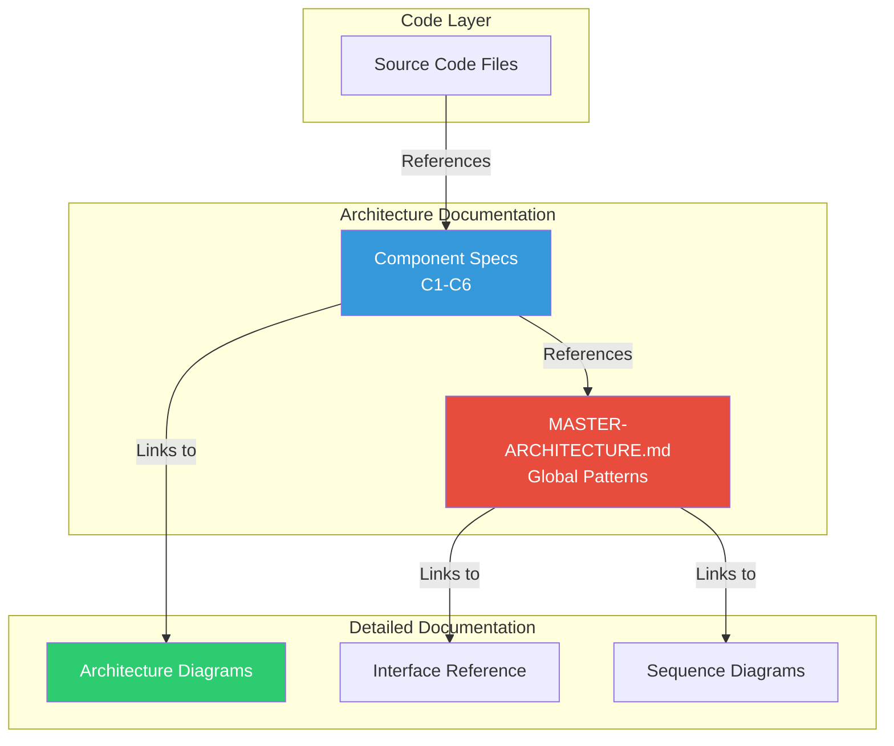

# Visual Integration Guide

## Documentation Architecture Integration

```
📁 rag-portfolio/
└── 📁 project-1-technical-rag/
    ├── 📁 src/
    │   ├── 📁 core/
    │   │   ├── 📄 platform_orchestrator.py → Links to → COMPONENT-1-PLATFORM-ORCHESTRATOR.md
    │   │   ├── 📄 query_processor.py ──────→ Links to → COMPONENT-6-QUERY-PROCESSOR.md
    │   │   └── 📄 component_factory.py ────→ Links to → MASTER-ARCHITECTURE.md#component-factory
    │   │
    │   └── 📁 components/
    │       ├── 📁 processors/
    │       │   └── 📄 pdf_processor.py ────→ Links to → COMPONENT-2-DOCUMENT-PROCESSOR.md
    │       ├── 📁 embedders/
    │       │   └── 📄 sentence_transformer.py → Links to → COMPONENT-3-EMBEDDER.md
    │       ├── 📁 retrievers/
    │       │   └── 📄 unified_retriever.py → Links to → COMPONENT-4-RETRIEVER.md
    │       └── 📁 generators/
    │           └── 📄 adaptive_generator.py → Links to → COMPONENT-5-ANSWER-GENERATOR.md
    │
    └── 📁 docs/
        └── 📁 architecture/                    ⭐ NEW DOCUMENTATION SUITE
            ├── 📄 README.md                    (Navigation Hub)
            ├── 📄 MASTER-ARCHITECTURE.md       (Global Patterns & Standards)
            │
            ├── 📁 components/                  (Component Specifications)
            │   ├── 📄 COMPONENT-1-PLATFORM-ORCHESTRATOR.md
            │   ├── 📄 COMPONENT-2-DOCUMENT-PROCESSOR.md
            │   ├── 📄 COMPONENT-3-EMBEDDER.md
            │   ├── 📄 COMPONENT-4-RETRIEVER.md
            │   ├── 📄 COMPONENT-5-ANSWER-GENERATOR.md
            │   └── 📄 COMPONENT-6-QUERY-PROCESSOR.md
            │
            └── 📁 diagrams/                    (Your existing detailed diagrams)
                ├── 📄 rag-architecture-diagram.md
                ├── 📄 rag-main-sequences.md
                ├── 📄 rag-component-architectures.md
                └── 📄 rag-interface-reference.md
```

## Reference Flow



## Quick Access Paths

### From Code to Documentation
```python
# In any component file
"""
Quick Links:
- Architecture: docs/architecture/components/COMPONENT-X-*.md
- Interfaces: docs/architecture/diagrams/rag-interface-reference.md
- Patterns: docs/architecture/MASTER-ARCHITECTURE.md
"""
```

### From Documentation to Code
```markdown
<!-- In any component documentation -->
## Implementation
- **Main Implementation**: [`src/components/.../component.py`](../../../src/components/.../component.py)
- **Interface Definition**: [`src/core/interfaces.py`](../../../src/core/interfaces.py)
- **Tests**: [`tests/.../test_component.py`](../../../tests/.../test_component.py)
```

## Navigation Patterns

### 1. **Developer Flow** (Component-Focused)
```
Developer working on Embedder
    ↓
COMPONENT-3-EMBEDDER.md (Start here)
    ↓
Check "Required Interfaces" section
    ↓
Follow link to → COMPONENT-2-DOCUMENT-PROCESSOR.md
    ↓
Check "Design Rationale" for adapter pattern
    ↓
Follow link to → MASTER-ARCHITECTURE.md#adapter-pattern
```

### 2. **Architect Flow** (System-Wide)
```
Architect reviewing system
    ↓
MASTER-ARCHITECTURE.md (Start here)
    ↓
Review "Global Architecture Decisions"
    ↓
Dive into specific → COMPONENT-X documents
    ↓
Cross-reference with → Detailed Diagrams
```

### 3. **New Team Member Flow**
```
Onboarding
    ↓
docs/architecture/README.md (Start here)
    ↓
Read MASTER-ARCHITECTURE.md (System overview)
    ↓
Follow data flow: C1 → C2 → C3 → C4 → C5/C6
    ↓
Study relevant component for their role
```

## Maintenance Workflow


## File Naming Conventions

```
✅ GOOD:
- MASTER-ARCHITECTURE.md (all caps for master doc)
- COMPONENT-1-PLATFORM-ORCHESTRATOR.md (numbered components)
- rag-main-sequences.md (lowercase for diagrams)

❌ AVOID:
- platform_orchestrator_arch.md (inconsistent naming)
- component1.md (missing descriptive name)
- Architecture.md (too generic)
```