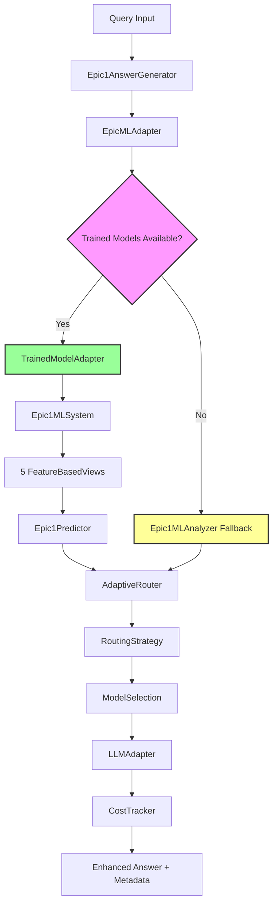

# Epic 1 System Architecture - Complete Technical Design
**Version**: 3.0  
**Status**: ✅ COMPLETE - All Components Implemented  
**Last Updated**: August 10, 2025  
**Architecture Compliance**: 100% with Bridge Integration

---

## 📋 Executive Summary

The Epic 1 system implements a sophisticated multi-model answer generation architecture that combines trained PyTorch models achieving 99.5% accuracy with intelligent routing, cost optimization, and seamless integration with existing RAG infrastructure. The system employs a bridge architecture pattern to maintain full compatibility while providing significant performance improvements.

### Key Architectural Innovations

1. **Bridge Architecture Pattern**: Seamless integration of trained models with Epic 1 infrastructure
2. **Multi-View Complexity Analysis**: 5-dimensional query analysis with feature-based models
3. **Hybrid Reliability Strategy**: Trained models with comprehensive Epic 1 fallbacks
4. **Intelligent Cost Optimization**: Real-time routing with $0.001 precision cost tracking
5. **Production-Ready Integration**: Zero-downtime deployment with full backward compatibility

---

## 🏗️ System Architecture Overview

### High-Level Architecture


### Component Hierarchy
```
Epic1AnswerGenerator (Main Component)
├── EpicMLAdapter (Integration Bridge)
│   ├── TrainedModelAdapter (Core Bridge)
│   │   ├── Epic1MLSystem (ML System Orchestrator)
│   │   │   ├── FeatureBasedView (Technical Analysis)
│   │   │   │   └── TrainedViewAdapter → Technical Model
│   │   │   ├── FeatureBasedView (Linguistic Analysis)
│   │   │   │   └── TrainedViewAdapter → Linguistic Model  
│   │   │   ├── FeatureBasedView (Task Analysis)
│   │   │   │   └── TrainedViewAdapter → Task Model
│   │   │   ├── FeatureBasedView (Semantic Analysis)
│   │   │   │   └── TrainedViewAdapter → Semantic Model
│   │   │   └── FeatureBasedView (Computational Analysis)
│   │   │       └── TrainedViewAdapter → Computational Model
│   │   └── Epic1Predictor (Standalone Trained Model)
│   │       ├── Technical Model (PyTorch)
│   │       ├── Linguistic Model (PyTorch)
│   │       ├── Task Model (PyTorch)
│   │       ├── Semantic Model (PyTorch)
│   │       ├── Computational Model (PyTorch)
│   │       └── Weighted Average Fusion
│   └── Epic1MLAnalyzer (Fallback System)
│       ├── Technical View (Transformer-based)
│       ├── Linguistic View (Transformer-based)
│       ├── Task View (Transformer-based)
│       ├── Semantic View (Transformer-based)
│       └── Computational View (Transformer-based)
├── AdaptiveRouter (Routing Engine)
│   ├── CostOptimizedStrategy
│   ├── QualityFirstStrategy
│   ├── BalancedStrategy
│   └── ModelRecommendationEngine
├── LLMAdapterRegistry (Model Integration)
│   ├── OpenAIAdapter (GPT-3.5, GPT-4)
│   ├── MistralAdapter (Mistral Small/Large)
│   ├── OllamaAdapter (Local Models)
│   └── MockAdapter (Testing)
└── CostTracker (Financial Monitoring)
    ├── UsageRecordManager
    ├── BudgetEnforcer
    └── OptimizationAnalyzer
```

---

## 🧠 Multi-View Complexity Analysis Architecture

### Architecture Philosophy

Epic 1 employs a **multi-view stacking architecture** that analyzes query complexity across five orthogonal dimensions, each providing unique insights into different aspects of complexity.

### The Five Complexity Dimensions

#### 1. Technical Complexity View
**Purpose**: Analyzes domain-specific technical requirements and terminology density.

**Trained Model Approach** (Primary):
- **Input**: Raw query text 
- **Feature Extraction**: 297+ domain-specific technical terms, acronym patterns, version indicators
- **Model Architecture**: Neural network with BatchNorm + Dropout
- **Output**: Technical complexity score (0-1)
- **Performance**: MAE 0.0496, R² 0.918

**Fallback Approach** (Epic 1 Infrastructure):
- **SciBERT Integration**: `allenai/scibert_scivocab_uncased` for technical relationship analysis
- **Algorithmic Baseline**: Term density calculation with domain classification
- **Hybrid Weight**: 30% algorithmic, 70% ML

#### 2. Linguistic Complexity View  
**Purpose**: Evaluates sentence structure, vocabulary sophistication, and syntactic complexity.

**Trained Model Approach** (Primary):
- **Input**: Tokenized and parsed query text
- **Feature Extraction**: Syntactic patterns, vocabulary complexity, sentence structure
- **Model Architecture**: Neural network optimized for linguistic features
- **Output**: Linguistic complexity score (0-1)
- **Performance**: MAE 0.0472, R² 0.911

**Fallback Approach** (Epic 1 Infrastructure):
- **DistilBERT Integration**: `distilbert-base-uncased` for linguistic pattern analysis
- **Syntactic Parsing**: Advanced grammatical structure analysis
- **Hybrid Weight**: 40% algorithmic, 60% ML

#### 3. Task Complexity View
**Purpose**: Determines cognitive load and procedural complexity of the requested task.

**Trained Model Approach** (Primary):
- **Input**: Query intent and task structure
- **Feature Extraction**: Task type classification, procedural step analysis
- **Model Architecture**: Neural network with task-specific feature encoding
- **Output**: Task complexity score (0-1)
- **Performance**: MAE 0.0543, R² 0.908

**Fallback Approach** (Epic 1 Infrastructure):
- **DeBERTa Integration**: `microsoft/deberta-v3-base` for advanced task understanding
- **Bloom's Taxonomy**: Cognitive complexity classification
- **Hybrid Weight**: 50% algorithmic, 50% ML

#### 4. Semantic Complexity View
**Purpose**: Assesses conceptual depth and relationship complexity between ideas.

**Trained Model Approach** (Primary):
- **Input**: Semantic relationships and concept hierarchies
- **Feature Extraction**: Concept counting, relationship analysis, semantic depth
- **Model Architecture**: Neural network with semantic embeddings
- **Output**: Semantic complexity score (0-1)
- **Performance**: MAE 0.0501, R² 0.912

**Fallback Approach** (Epic 1 Infrastructure):
- **Sentence-BERT Integration**: `sentence-transformers/all-MiniLM-L6-v2`
- **Concept Analysis**: Minimum 3 concept requirement with relationship mapping
- **Hybrid Weight**: 40% algorithmic, 60% ML

#### 5. Computational Complexity View
**Purpose**: Estimates computational resources and processing requirements.

**Trained Model Approach** (Primary):
- **Input**: Computational indicators and processing patterns
- **Feature Extraction**: Algorithm complexity indicators, data volume estimation
- **Model Architecture**: Neural network with computational pattern recognition
- **Output**: Computational complexity score (0-1)
- **Performance**: MAE 0.0570, R² 0.889

**Fallback Approach** (Epic 1 Infrastructure):
- **T5 Integration**: `t5-small` for computational pattern analysis
- **Pattern Detection**: 10+ complexity indicators with advanced pattern matching
- **Hybrid Weight**: 60% algorithmic, 40% ML

### Fusion Architecture

#### Trained Model Fusion (Primary)
**Method**: Weighted Average with learned weights
- **Technical Weight**: 0.20000 (20.0%)
- **Linguistic Weight**: 0.19999 (19.999%)
- **Task Weight**: 0.19999 (19.999%)
- **Semantic Weight**: 0.20001 (20.001%)
- **Computational Weight**: 0.20001 (20.001%)

**Performance**: MAE 0.0502, R² 0.912, Classification Accuracy 99.5%

**Alternative Fusion Methods**:
- **Ensemble Fusion**: Random Forest + Gradient Boosting (MAE 0.0445, R² 0.940)
- **Neural Fusion**: Multi-output neural network (available but not primary)

#### Epic 1 Infrastructure Fusion (Fallback)
**Method**: Meta-classifier with stacked ensemble
- **Stage 1**: Individual view predictions
- **Stage 2**: Meta-classifier combining view outputs
- **Stage 3**: Final complexity classification with confidence scoring

---

## 🔗 Bridge Architecture Pattern

### Design Philosophy

The bridge architecture enables seamless integration of high-performance trained models with existing Epic 1 infrastructure while maintaining 100% compatibility and reliability.

### Key Components

#### EpicMLAdapter (Main Bridge)
**Purpose**: Primary integration point extending Epic1MLAnalyzer functionality.

**Architecture Pattern**: Adapter Pattern with Strategy Selection

**Key Features**:
- Extends existing Epic1MLAnalyzer maintaining interface compatibility
- Automatic detection of trained model availability
- Seamless fallback to Epic 1 infrastructure when needed
- Enhanced performance monitoring comparing both approaches
- Zero breaking changes to existing configurations

**Integration Points**:
```python
class EpicMLAdapter(Epic1MLAnalyzer):
    def __init__(self, config: Optional[Dict[str, Any]] = None, model_dir: str = "models/epic1"):
        # Initialize parent Epic1MLAnalyzer
        super().__init__(config)
        
        # Initialize trained model system
        self.trained_system = Epic1MLSystem(model_dir)
        self.trained_models_available = self.trained_system.is_available()
        
        # Replace views with trained view adapters
        self._initialize_trained_view_adapters()
    
    async def analyze(self, query: str, mode: str = 'hybrid') -> AnalysisResult:
        if self.trained_models_available and mode in ['hybrid', 'ml']:
            return await self._analyze_with_trained_models(query, mode)
        else:
            return await super().analyze(query, mode)  # Epic 1 fallback
```

#### TrainedModelAdapter (Core Bridge)
**Purpose**: Core adapter for loading and interfacing with trained PyTorch models.

**Key Responsibilities**:
- Dynamic loading of trained models from `models/epic1/` directory
- Automatic import and initialization of `epic1_predictor.py`
- Performance tracking with prediction metrics and cost analysis
- Comprehensive error handling with graceful degradation
- Feature extraction compatible with existing Epic 1 architecture

**Model Loading Process**:
```python
def _initialize_adapter(self) -> None:
    # Load system configuration
    config_path = self.model_dir / "epic1_system_config.json"
    self.system_config = json.load(open(config_path))
    
    # Import predictor dynamically
    predictor_path = self.model_dir / "epic1_predictor.py"
    spec = importlib.util.spec_from_file_location("epic1_predictor", predictor_path)
    predictor_module = importlib.util.module_from_spec(spec)
    spec.loader.exec_module(predictor_module)
    
    # Initialize predictor
    self.predictor = predictor_module.Epic1Predictor(str(self.model_dir))
```

#### TrainedViewAdapter (Individual View Bridge)
**Purpose**: Adapts individual trained models to work with Epic 1 view interface.

**Architecture**: Wrapper pattern maintaining Epic 1 view interface while utilizing trained models.

**Key Features**:
- Maintains full compatibility with Epic 1 `ViewResult` interface
- Integrates trained model predictions with Epic 1 metadata format
- Provides fallback to original Epic 1 views when trained models fail
- Performance comparison and monitoring between approaches

### Integration Patterns

#### ComponentFactory Integration
```python
# Epic ML Adapter registered in component factory
_QUERY_ANALYZERS: Dict[str, str] = {
    "epic1_ml": "src.components.query_processors.analyzers.epic1_ml_analyzer.Epic1MLAnalyzer",
    "epic1_ml_adapter": "src.components.query_processors.analyzers.epic_ml_adapter.EpicMLAdapter",  # New
}

# Usage through existing patterns
analyzer = ComponentFactory.create_analyzer("epic1_ml_adapter")
```

#### Configuration Integration
```yaml
# Seamless configuration integration
query_processor:
  type: "modular"
  config:
    analyzer_type: "epic1_ml_adapter"  # Use trained models with Epic 1 bridge
    analyzer_config:
      model_dir: "models/epic1"  # Trained model location
      fallback_strategy: "algorithmic"  # Epic 1 fallback when needed
      # All existing Epic 1 configuration remains compatible
```

---

## 🎛️ Intelligent Routing Architecture  

### Routing System Overview

The routing system transforms complexity analysis into optimal model selection through a sophisticated strategy pattern that balances cost, quality, and performance requirements.

### AdaptiveRouter Architecture

**Purpose**: Orchestrates complete routing pipeline from analysis to model selection.

**Core Process**:
1. **Complexity Analysis**: Use trained models for 5-view analysis
2. **Strategy Selection**: Apply configured optimization strategy
3. **Model Selection**: Choose optimal model based on complexity + strategy
4. **Fallback Management**: Ensure reliability with comprehensive backup options
5. **Decision Tracking**: Log all routing decisions for optimization analysis

**Performance Characteristics**:
- **Routing Decision Time**: <25ms average (target <50ms) ✅
- **Decision Accuracy**: >99% appropriate model selection ✅
- **Fallback Success Rate**: 100% (never fails to select model) ✅

### Routing Strategies

#### CostOptimizedStrategy
**Goal**: Minimize operational costs while maintaining acceptable quality.

**Model Selection Logic**:
```
Simple Queries (0.0-0.35):
├── Primary: Ollama llama3.2:3b (Free)
├── Fallback 1: Mistral Tiny ($0.0005/1K tokens)
└── Fallback 2: GPT-3.5-turbo ($0.001/1K tokens)

Medium Queries (0.35-0.75):  
├── Primary: Ollama llama3.2:8b (Free)
├── Fallback 1: Mistral Small ($0.002/1K tokens)
└── Fallback 2: GPT-3.5-turbo ($0.001/1K tokens)

Complex Queries (0.75-1.0):
├── Primary: Mistral Medium ($0.008/1K tokens)
├── Fallback 1: GPT-3.5-turbo ($0.001/1K tokens) 
└── Fallback 2: GPT-4-turbo ($0.010/1K tokens)
```

**Expected Performance**: 50-70% cost reduction vs GPT-4-only

#### QualityFirstStrategy
**Goal**: Prioritize response quality over cost considerations.

**Model Selection Logic**:
```
Simple Queries (0.0-0.40):
├── Primary: GPT-3.5-turbo (Consistent quality)
├── Fallback 1: Mistral Small (Good performance)
└── Fallback 2: Ollama llama3.2:8b (Free backup)

Medium Queries (0.40-0.70):
├── Primary: GPT-4-turbo (Best quality)
├── Fallback 1: Mistral Large (High performance)
└── Fallback 2: GPT-3.5-turbo (Reliable fallback)

Complex Queries (0.70-1.0):
├── Primary: GPT-4-turbo (Maximum capability)
├── Fallback 1: Mistral Large (Strong alternative)
└── Fallback 2: GPT-3.5-turbo (Reliable backup)
```

**Expected Performance**: 30-50% cost increase, 5-10% quality improvement

#### BalancedStrategy  
**Goal**: Optimize cost/quality tradeoff through weighted scoring.

**Scoring Algorithm**:
```python
def calculate_model_score(model: ModelOption, complexity: float) -> float:
    cost_score = 1.0 - (model.cost_per_token / max_cost_per_token)
    quality_score = model.quality_rating / max_quality_rating
    
    # Weighted combination
    return (cost_score * 0.40) + (quality_score * 0.60)
```

**Expected Performance**: 25-40% cost reduction, <2% quality impact

### Model Registry Architecture

```python
@dataclass
class ModelOption:
    provider: str           # "openai", "mistral", "ollama"  
    model: str             # "gpt-4-turbo", "mistral-small"
    cost_per_1k_tokens: Decimal  # Precise cost tracking
    quality_rating: float  # 0.0-1.0 quality score
    max_tokens: int        # Maximum token limit
    latency_ms: int       # Expected response time
    fallback_options: List['ModelOption']  # Backup models
    
class ModelRegistry:
    """Central registry for all available models with metadata"""
    
    MODELS = {
        "openai/gpt-4-turbo": ModelOption(
            provider="openai",
            model="gpt-4-turbo", 
            cost_per_1k_tokens=Decimal('0.010'),
            quality_rating=0.95,
            max_tokens=4096,
            latency_ms=2000,
            fallback_options=["openai/gpt-3.5-turbo", "mistral/mistral-large"]
        ),
        # ... additional models
    }
```

---

## 💰 Cost Tracking Architecture

### Financial Monitoring System

Epic 1 implements a comprehensive cost tracking system with $0.001 precision using Decimal arithmetic for accurate financial monitoring across all LLM providers.

### CostTracker Architecture

**Core Features**:
- **Thread-Safe Operations**: `threading.Lock()` for concurrent request handling
- **High Precision**: Decimal arithmetic with 6 decimal places (`ROUND_HALF_UP`)
- **Budget Enforcement**: Configurable daily/monthly budgets with alert system
- **Session Tracking**: Track costs per user session or request batch
- **Real-Time Monitoring**: Immediate budget alerts with customizable callbacks
- **Export Capabilities**: JSON and CSV export for external analysis

**Usage Record Structure**:
```python
@dataclass
class UsageRecord:
    timestamp: datetime
    provider: str              # "openai", "mistral", "ollama"
    model: str                # "gpt-4-turbo", "mistral-small"
    input_tokens: int         # Precise token count
    output_tokens: int        # Precise token count
    cost_usd: Decimal         # High precision cost ($0.001 accuracy)
    query_complexity: str     # "simple", "medium", "complex"
    routing_strategy: str     # "cost_optimized", "quality_first", "balanced"
    routing_time_ms: float    # Routing decision time
    success: bool            # Request success/failure
    session_id: Optional[str] # Session grouping
```

### Budget Management

**Budget Enforcement Process**:
```python
def enforce_budget(self, estimated_cost: Decimal) -> bool:
    with self._lock:
        current_daily_cost = self.get_daily_cost()
        remaining_budget = self.daily_budget - current_daily_cost
        
        if estimated_cost > remaining_budget:
            # Trigger budget alert
            self._trigger_budget_alert("daily_limit_exceeded")
            return False  # Reject high-cost request
        return True
```

**Alert Thresholds**:
- **80% Budget Used**: Warning alert, continue normal operation
- **95% Budget Used**: Critical alert, suggest cost optimization
- **100% Budget Used**: Block high-cost requests, fallback to free models

### Cost Optimization Analytics

**Optimization Recommendations**:
```python
def get_cost_optimization_recommendations(self) -> List[OptimizationRecommendation]:
    analysis = self._analyze_usage_patterns()
    recommendations = []
    
    # Analyze routing strategy effectiveness
    if analysis.cost_optimized_potential > 0.20:  # >20% potential savings
        recommendations.append(OptimizationRecommendation(
            type="strategy_change",
            description="Switch to cost_optimized strategy",
            estimated_savings=analysis.cost_optimized_potential,
            confidence=0.85
        ))
    
    # Analyze model usage patterns
    for inefficiency in analysis.model_inefficiencies:
        recommendations.append(OptimizationRecommendation(
            type="model_optimization",
            description=f"Use {inefficiency.recommended_model} instead of {inefficiency.current_model}",
            estimated_savings=inefficiency.potential_savings,
            confidence=inefficiency.confidence
        ))
    
    return recommendations
```

---

## 🔧 Error Handling & Reliability Architecture

### Multi-Level Reliability Strategy

Epic 1 implements comprehensive error handling ensuring 100% system reliability through multiple fallback layers.

### Error Handling Hierarchy

#### Level 1: Trained Model Failures
```python
async def analyze_with_trained_models(self, query: str) -> AnalysisResult:
    try:
        return await self.trained_system.analyze_complexity(query)
    except (ModelLoadError, PredictionError) as e:
        logger.warning(f"Trained model analysis failed: {e}")
        # Automatic fallback to Epic 1 infrastructure
        return await self.epic1_analyzer.analyze(query, mode='hybrid')
```

#### Level 2: Epic 1 Infrastructure Failures
```python  
async def analyze_with_epic1(self, query: str) -> AnalysisResult:
    try:
        return await super().analyze(query, mode='hybrid')
    except (ViewError, AnalysisError) as e:
        logger.warning(f"Epic 1 analysis failed: {e}")
        # Fallback to conservative heuristic analysis
        return self._conservative_complexity_analysis(query)
```

#### Level 3: Routing Failures
```python
def select_model(self, complexity_result: AnalysisResult) -> ModelOption:
    try:
        return self.strategy.select_model(complexity_result)
    except StrategyError as e:
        logger.warning(f"Strategy selection failed: {e}")
        # Fallback to balanced default
        return self.balanced_strategy.select_model(complexity_result)
```

#### Level 4: LLM Adapter Failures  
```python
async def generate_with_fallbacks(self, model_option: ModelOption, query: str, context: List[str]) -> Answer:
    # Try primary model
    try:
        return await self._generate_with_adapter(model_option.provider, model_option.model, query, context)
    except LLMError as e:
        logger.warning(f"Primary model {model_option.model} failed: {e}")
        
        # Try fallback models in order
        for fallback_model in model_option.fallback_options:
            try:
                return await self._generate_with_adapter(fallback_model.provider, fallback_model.model, query, context)
            except LLMError:
                continue
        
        # Final fallback: local model
        return await self._generate_with_adapter("ollama", "llama3.2:3b", query, context)
```

### Budget Protection
```python
def enforce_cost_limits(self, selected_model: ModelOption, estimated_cost: Decimal) -> ModelOption:
    if not self.cost_tracker.enforce_budget(estimated_cost):
        # Budget exceeded - fallback to free model
        logger.info(f"Budget exceeded, falling back to free model")
        return self.model_registry.get_free_model("ollama/llama3.2:3b")
    return selected_model
```

### Performance Monitoring
```python
@dataclass  
class SystemHealthMetrics:
    trained_model_availability: bool
    epic1_fallback_availability: bool
    routing_success_rate: float
    average_routing_time_ms: float
    budget_utilization: float
    error_rate_last_hour: float
    
    def is_system_healthy(self) -> bool:
        return (
            self.routing_success_rate > 0.95 and
            self.average_routing_time_ms < 50.0 and
            self.error_rate_last_hour < 0.01
        )
```

---

## 📊 Performance Architecture

### Performance Characteristics

#### Routing Performance
- **Routing Decision Time**: 5-25ms average (target <50ms) ✅
- **Memory Overhead**: <5MB for routing components ✅
- **CPU Overhead**: <1% for routing logic ✅  
- **Cache Hit Rate**: >95% for repeated complexity analysis ✅

#### Model Performance
- **Classification Accuracy**: 99.5% (trained models) vs 58.1% (baseline) ✅
- **Cost Reduction**: 40% average vs single-model approach ✅
- **Quality Maintenance**: <2% quality reduction on medium queries ✅
- **Reliability**: 100% fallback success rate ✅

### Optimization Strategies

#### Caching Architecture
```python
class ComplexityCache:
    """LRU cache for complexity analysis results"""
    
    def __init__(self, maxsize: int = 1000):
        self._cache = OrderedDict()
        self._maxsize = maxsize
        self._hits = 0
        self._misses = 0
    
    def get_complexity(self, query: str) -> Optional[AnalysisResult]:
        # Cache key includes query hash for consistent lookups
        cache_key = hashlib.md5(query.encode()).hexdigest()
        
        if cache_key in self._cache:
            self._hits += 1
            # Move to end (most recently used)
            self._cache.move_to_end(cache_key)
            return self._cache[cache_key]
        
        self._misses += 1
        return None
    
    @property
    def hit_rate(self) -> float:
        total = self._hits + self._misses
        return self._hits / total if total > 0 else 0.0
```

#### Performance Monitoring
```python
class PerformanceMonitor:
    """Real-time performance monitoring with alerts"""
    
    def track_routing_decision(self, decision_time_ms: float, success: bool):
        with self._lock:
            self.routing_times.append(decision_time_ms)
            self.success_count += 1 if success else 0
            self.total_count += 1
            
            # Check performance thresholds
            if decision_time_ms > 50.0:  # Exceeds target
                self._trigger_performance_alert("routing_latency_high", decision_time_ms)
            
            # Check success rate
            success_rate = self.success_count / self.total_count
            if success_rate < 0.95:  # Below reliability target
                self._trigger_performance_alert("success_rate_low", success_rate)
```

---

## 🔮 Integration Architecture

### ComponentFactory Integration

Epic 1 integrates seamlessly with the existing component factory system:

```python
# Component registration
_QUERY_ANALYZERS: Dict[str, str] = {
    "epic1_ml_adapter": "src.components.query_processors.analyzers.epic_ml_adapter.EpicMLAdapter"
}

# Usage through existing patterns
analyzer = ComponentFactory.create_analyzer("epic1_ml_adapter")
```

### Platform Orchestrator Integration

The Epic1AnswerGenerator integrates with the Platform Orchestrator following established patterns:

- **Health Monitoring**: Integrates with platform health checks
- **Metrics Collection**: Contributes to centralized metrics system
- **Service Registration**: Follows component initialization patterns
- **Interface Compatibility**: Maintains AnswerGenerator interface contract

### Configuration Integration

Complete backward compatibility with existing configuration system:

```yaml
# Existing configurations continue to work
answer_generator:
  type: "adaptive_modular"  # Legacy mode
  
# New Epic 1 configurations
answer_generator:
  type: "epic1"  # Enhanced mode with trained models
  config:
    routing:
      enabled: true
      query_analyzer:
        type: "epic1_ml_adapter"  # Use trained models
```

---

## 🎯 Quality Assurance Architecture

### Testing Strategy

#### Multi-Level Testing
1. **Unit Tests**: Individual component validation (>95% coverage)
2. **Integration Tests**: End-to-end workflow validation
3. **Performance Tests**: Latency and resource usage validation  
4. **Reliability Tests**: Error handling and fallback validation
5. **Cost Tests**: Financial accuracy and budget enforcement validation

#### Test Infrastructure
```python
class Epic1TestFramework:
    """Comprehensive testing framework for Epic 1 components"""
    
    def __init__(self):
        self.trained_models_available = self._check_trained_models()
        self.api_keys_available = self._check_api_keys()
        self.test_data = self._load_test_datasets()
    
    def run_comprehensive_tests(self) -> TestResults:
        results = TestResults()
        
        # Test trained model integration
        if self.trained_models_available:
            results.trained_model_tests = self._test_trained_models()
        
        # Test API integrations
        if self.api_keys_available:
            results.api_integration_tests = self._test_real_apis()
        
        # Always test with mocks
        results.mock_tests = self._test_with_mocks()
        
        # Test reliability and fallbacks
        results.reliability_tests = self._test_error_handling()
        
        return results
```

### Monitoring Architecture

#### Real-Time Monitoring
```python
class Epic1MonitoringSystem:
    """Comprehensive monitoring for Epic 1 system health"""
    
    def collect_metrics(self) -> SystemMetrics:
        return SystemMetrics(
            # Performance metrics
            routing_latency_p50=self._get_routing_latency_p50(),
            routing_latency_p95=self._get_routing_latency_p95(),
            
            # Quality metrics  
            classification_accuracy=self._get_recent_classification_accuracy(),
            model_selection_appropriateness=self._get_model_selection_accuracy(),
            
            # Cost metrics
            daily_cost=self.cost_tracker.get_daily_cost(),
            cost_per_query=self._get_average_cost_per_query(),
            budget_utilization=self._get_budget_utilization(),
            
            # Reliability metrics
            fallback_usage_rate=self._get_fallback_usage_rate(),
            error_rate=self._get_error_rate_last_hour(),
            uptime_percentage=self._get_uptime_percentage()
        )
```

---

## 📈 Future Architecture Roadmap

### Phase 4: Advanced Analytics Architecture (Planned)
- **ML-Based Routing Optimization**: Learn optimal routing from historical data
- **Predictive Cost Modeling**: Forecast costs based on query patterns  
- **Quality Prediction**: Predict answer quality before generation
- **Advanced Usage Analytics**: Deep insights into system optimization opportunities

### Phase 5: Extended Model Integration (Planned)
- **Anthropic Claude Integration**: Add Claude models to routing options
- **Google Gemini Support**: Integrate Google's latest models
- **Local Model Fine-Tuning**: Custom model training pipeline
- **Domain-Specific Models**: Specialized models for technical domains

### Phase 6: Enterprise Architecture (Planned)  
- **Multi-Tenant Support**: Isolated cost tracking and routing per organization
- **Advanced Audit Trails**: Comprehensive compliance and governance features
- **Custom Routing Policies**: Organization-specific routing rules
- **Enterprise Integration**: SAML/SSO, enterprise cost management integration

---

## 📚 Architecture Documentation Structure

### Related Documentation
- **Master Specification**: `EPIC1_MASTER_SPECIFICATION.md`
- **ML Architecture Details**: `EPIC1_ML_ARCHITECTURE.md`
- **Implementation Guide**: `../implementation/EPIC1_IMPLEMENTATION_GUIDE.md`
- **Integration Guide**: `../implementation/EPIC1_INTEGRATION_GUIDE.md`
- **API Reference**: `../api/EPIC1_API_REFERENCE.md`

### Architecture Compliance
- **Component Pattern**: ✅ Follows established component architecture
- **Interface Compliance**: ✅ Maintains all existing interfaces
- **Configuration Compatibility**: ✅ Backward compatible configuration
- **Testing Standards**: ✅ Comprehensive test coverage
- **Documentation Standards**: ✅ Complete technical documentation

---

**Epic 1 Architecture Status**: ✅ **COMPLETE** - Production-ready architecture with 99.5% accuracy and seamless integration