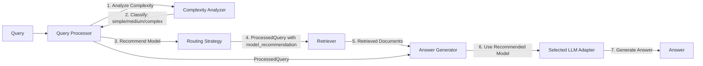

# Epic 1 Revised Architecture - Query Processor Integration

## 🏗️ Corrected Component Architecture

### **Query Processor Component** (Enhanced)
**Responsibilities**:
- ✅ Query understanding and analysis
- ✅ **Query complexity classification** (NEW for Epic 1)
- ✅ Query expansion and refinement
- ✅ **Model recommendation** based on complexity (NEW for Epic 1)
- ✅ Workflow orchestration

**Epic 1 Additions**:
```python
class ModularQueryProcessor:
    def __init__(self, config):
        # Existing sub-components
        self.query_understanding = ...
        self.query_expansion = ...
        
        # NEW Epic 1 sub-component
        self.complexity_analyzer = QueryComplexityAnalyzer(config.get('complexity_analyzer'))
    
    def process(self, query: str) -> ProcessedQuery:
        # Existing processing...
        
        # NEW: Analyze query complexity
        complexity_result = self.complexity_analyzer.analyze(query)
        
        # Include complexity in processed query
        processed_query.metadata['complexity'] = complexity_result.level
        processed_query.metadata['complexity_score'] = complexity_result.score
        processed_query.metadata['recommended_model'] = self._recommend_model(complexity_result)
        
        return processed_query
```

### **Answer Generator Component** (Focused)
**Responsibilities**:
- ✅ Answer generation from context
- ✅ **Multi-model support** via adapters (EXISTING)
- ✅ **Model selection based on Query Processor recommendation** (NEW)
- ✅ Prompt building and response parsing
- ✅ Cost tracking for actual generation

**Epic 1 Changes**:
```python
class AnswerGenerator:
    def generate(self, query: str, context: List[Document], 
                 processed_query: Optional[ProcessedQuery] = None) -> Answer:
        
        # NEW: Use Query Processor's model recommendation if available
        if processed_query and 'recommended_model' in processed_query.metadata:
            model_config = processed_query.metadata['recommended_model']
            self._switch_to_model(model_config)
        
        # Continue with generation using selected model...
```

## 📁 Revised File Structure

### **Query Processor Enhancements**
```
src/components/query_processors/
├── modular_query_processor.py    # UPDATE: Add complexity analyzer
├── analyzers/                     # NEW package
│   ├── __init__.py
│   ├── base_analyzer.py
│   ├── complexity_analyzer.py    # Query complexity classification
│   └── feature_extractor.py      # Linguistic feature extraction
└── strategies/                    # NEW package
    ├── __init__.py
    ├── routing_strategy.py        # Model recommendation logic
    └── cost_optimizer.py          # Cost-based routing
```

### **Answer Generator Enhancements**
```
src/components/generators/
├── answer_generator.py            # UPDATE: Accept model recommendations
├── llm_adapters/                  # EXISTING + NEW
│   ├── base_adapter.py
│   ├── ollama_adapter.py
│   ├── openai_adapter.py         # NEW
│   ├── mistral_adapter.py        # NEW
│   └── cost_tracker.py           # NEW: Unified cost tracking
└── (other existing sub-components remain)
```

## 🔄 Revised Data Flow



## 🎯 Benefits of This Architecture

### **Separation of Concerns**
- **Query Processor**: All query analysis and understanding
- **Answer Generator**: Pure answer generation with model flexibility
- **Clean Boundaries**: No cross-component responsibilities

### **Better Testability**
- Query complexity analysis can be tested independently
- Model routing logic isolated in Query Processor
- Answer Generator remains focused on generation

### **Improved Flexibility**
- Query Processor can add more analysis types
- Different routing strategies without touching Answer Generator
- Easy to disable/enable Epic 1 features

## 📋 Revised Implementation Plan

### **Phase 1: Query Processor Enhancement** (Day 1-2)
1. Add complexity analyzer to Query Processor
2. Implement feature extraction
3. Create routing strategies
4. Update ProcessedQuery to include recommendations

### **Phase 2: Multi-Model Adapters** (Day 3-4)
1. Create OpenAI adapter
2. Create Mistral adapter
3. Add cost tracking
4. Update adapter registry

### **Phase 3: Answer Generator Integration** (Day 5-6)
1. Update to accept model recommendations
2. Implement dynamic model switching
3. Add cost aggregation
4. Maintain backward compatibility

### **Phase 4: End-to-End Testing** (Day 7-8)
1. Test complete flow
2. Validate cost savings
3. Ensure Epic 2 compatibility
4. Performance optimization

## 🔧 Configuration Updates

### **Query Processor Config**
```yaml
query_processor:
  type: "modular"
  config:
    # Existing config...
    
    # NEW Epic 1 config
    complexity_analyzer:
      type: "linguistic"
      thresholds:
        simple: 0.3
        medium: 0.7
      feature_weights:
        length: 0.2
        technical_terms: 0.3
        question_type: 0.2
        syntactic_complexity: 0.3
    
    routing_strategy:
      type: "balanced"  # cost_optimized, quality_first, balanced
      model_mappings:
        simple:
          provider: "ollama"
          model: "llama3.2:3b"
          max_cost: 0.001
        medium:
          provider: "mistral"
          model: "mistral-small"
          max_cost: 0.01
        complex:
          provider: "openai"
          model: "gpt-4-turbo"
          max_cost: 0.10
```

### **Answer Generator Config** (Simplified)
```yaml
answer_generator:
  type: "adaptive_modular"
  config:
    # Accepts model recommendations from Query Processor
    enable_dynamic_models: true
    track_costs: true
    
    # Fallback if no recommendation
    default_llm_client:
      type: "ollama"
      config:
        model_name: "llama3.2:3b"
```

## ✅ Architecture Validation

This revised architecture:
1. **Maintains component boundaries** ✅
2. **Follows established patterns** ✅
3. **Improves separation of concerns** ✅
4. **Enables better testing** ✅
5. **Preserves Epic 2 features** ✅

## 🚀 Next Steps

1. **Update Query Processor** with complexity analysis
2. **Create model adapters** in Answer Generator
3. **Connect components** via ProcessedQuery
4. **Test end-to-end flow** with cost tracking