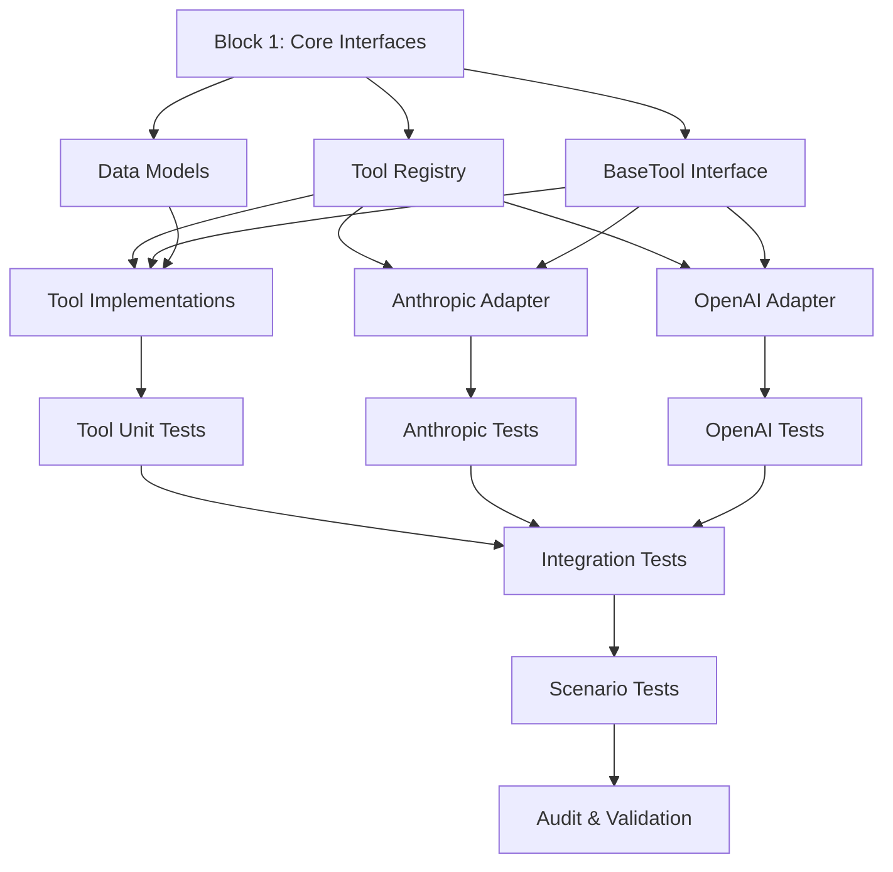

# Phase 1: Detailed Implementation & Execution Plan

**Version**: 1.0
**Date**: 2025-11-17
**Total Estimated Time**: 8-12 hours
**Parallel Execution Strategy**: Maximum parallelization where possible

---

## Table of Contents

1. [Execution Strategy](#execution-strategy)
2. [Task Dependency Graph](#task-dependency-graph)
3. [Sequential Implementation Blocks](#sequential-implementation-blocks)
4. [Parallel Execution Plan](#parallel-execution-plan)
5. [Testing Strategy](#testing-strategy)
6. [Validation & Audit](#validation--audit)

---

## Execution Strategy

### Principles

1. **Maximize Parallelism**: Independent components implemented simultaneously
2. **Minimize Risk**: Core interfaces before implementations
3. **Test Early**: Unit tests alongside implementation
4. **Validate Often**: Integration tests after each block
5. **Audit Last**: Comprehensive validation before Phase 2

### Approach

```
Block 1 (Sequential): Core Interfaces & Data Models
    ↓
Block 2 (Parallel): Tool Implementations + Adapters
    ↓
Block 3 (Parallel): Unit Tests + Integration Tests
    ↓
Block 4 (Sequential): Integration & Scenario Tests
    ↓
Block 5 (Sequential): Audit & Validation
```

---

## Task Dependency Graph



---

## Sequential Implementation Blocks

### Block 1: Core Interfaces & Data Models (1.5 hours)

**Goal**: Establish contracts before implementation

**Tasks** (Sequential - Must be in order):

#### Task 1.1: Data Models (30 minutes)

**File**: `src/components/query_processors/tools/models.py`

**Deliverables**:
```python
# All data models defined:
- ToolParameterType (Enum)
- ToolParameter (dataclass)
- ToolResult (dataclass)
- ToolCall (dataclass)
- ToolExecution (dataclass)
- ToolConversation (dataclass)
```

**Definition of Done**:
- ✅ All dataclasses with type hints
- ✅ Docstrings for all classes
- ✅ Validated with mypy
- ✅ Unit tests for dataclass creation

**Agent Assignment**: Single agent (critical path)

---

#### Task 1.2: BaseTool Interface (30 minutes)

**File**: `src/components/query_processors/tools/base_tool.py`

**Deliverables**:
```python
# Abstract base class:
class BaseTool(ABC):
    - name property
    - description property
    - get_parameters() method
    - execute() method
    - validate_parameters() method
    - to_anthropic_schema() method
    - to_openai_schema() method
```

**Definition of Done**:
- ✅ ABC with all abstract methods
- ✅ Type hints 100%
- ✅ Docstrings complete
- ✅ Helper methods for schema conversion
- ✅ Validated with mypy

**Dependencies**: Task 1.1 (uses ToolParameter, ToolResult)

**Agent Assignment**: Single agent

---

#### Task 1.3: ToolRegistry Interface (30 minutes)

**File**: `src/components/query_processors/tools/tool_registry.py`

**Deliverables**:
```python
class ToolRegistry:
    - register() method
    - unregister() method
    - get_tool() method
    - get_all_tools() method
    - get_anthropic_schemas() method
    - get_openai_schemas() method
    - execute_tool() method
```

**Definition of Done**:
- ✅ Thread-safe implementation (use locks)
- ✅ Type hints 100%
- ✅ Docstrings complete
- ✅ Error handling for duplicate tools
- ✅ Validated with mypy

**Dependencies**: Task 1.2 (uses BaseTool)

**Agent Assignment**: Single agent

---

**Block 1 Total Time**: 1.5 hours (Sequential)

**Block 1 DoD**:
- ✅ All interfaces defined
- ✅ All type hints validated
- ✅ No implementation yet (just interfaces)
- ✅ Unit tests for data models
- ✅ Ready for parallel implementation

---

### Block 2: Parallel Implementation (4-5 hours)

**Goal**: Implement all components in parallel

**Parallelization Strategy**: 3 agents working simultaneously

#### Agent 1: Tool Implementations (3-4 hours)

**Tasks**:

##### Task 2.1A: Calculator Tool (1 hour)

**File**: `src/components/query_processors/tools/implementations/calculator_tool.py`

**Deliverables**:
```python
class CalculatorTool(BaseTool):
    name = "calculator"
    description = "Evaluate mathematical expressions"

    def execute(self, expression: str) -> ToolResult:
        # Safe math evaluation (ast.literal_eval or numexpr)
        # Return ToolResult with answer or error
```

**Definition of Done**:
- ✅ Implements BaseTool interface
- ✅ Safe expression evaluation (no eval()!)
- ✅ Handles math errors gracefully
- ✅ Supports +, -, *, /, **, sqrt, etc.
- ✅ Type hints 100%
- ✅ Docstrings complete
- ✅ Unit tests >90% coverage

---

##### Task 2.1B: Document Search Tool (1.5 hours)

**File**: `src/components/query_processors/tools/implementations/document_search_tool.py`

**Deliverables**:
```python
class DocumentSearchTool(BaseTool):
    name = "search_documents"
    description = "Search RAG documents for relevant information"

    def __init__(self, retriever: Retriever):
        self.retriever = retriever

    def execute(
        self,
        query: str,
        max_results: int = 5
    ) -> ToolResult:
        # Use existing retriever
        # Format results for LLM
```

**Definition of Done**:
- ✅ Implements BaseTool interface
- ✅ Integrates with existing Retriever
- ✅ Formats results clearly for LLM
- ✅ Handles empty results gracefully
- ✅ Type hints 100%
- ✅ Docstrings complete
- ✅ Unit tests with mock retriever >90%
- ✅ Integration test with real retriever

---

##### Task 2.1C: Code Analyzer Tool (1-1.5 hours)

**File**: `src/components/query_processors/tools/implementations/code_analyzer_tool.py`

**Deliverables**:
```python
class CodeAnalyzerTool(BaseTool):
    name = "analyze_code"
    description = "Analyze code for syntax, style, complexity"

    def execute(
        self,
        code: str,
        language: str = "python"
    ) -> ToolResult:
        # Use ast for Python
        # Return analysis results
```

**Definition of Done**:
- ✅ Implements BaseTool interface
- ✅ Python code analysis (ast module)
- ✅ Syntax validation
- ✅ Complexity metrics (optional)
- ✅ Clear analysis output
- ✅ Type hints 100%
- ✅ Docstrings complete
- ✅ Unit tests >90% coverage

---

#### Agent 2: Anthropic Adapter (2-2.5 hours)

##### Task 2.2: AnthropicAdapter with Tools (2-2.5 hours)

**File**: `src/components/generators/llm_adapters/anthropic_adapter.py`

**Deliverables**:
```python
class AnthropicAdapter(BaseLLMAdapter):
    # Existing base adapter functionality
    # Plus new method:

    def generate_with_tools(
        self,
        prompt: str,
        tools: List[Dict[str, Any]],
        params: GenerationParams,
        max_iterations: int = 5
    ) -> ToolUseResult:
        # Multi-turn tool conversation
        # Tool call extraction
        # Tool result formatting
        # Cost tracking
```

**Definition of Done**:
- ✅ Extends BaseLLMAdapter (no breaking changes)
- ✅ `generate_with_tools()` working
- ✅ Multi-turn conversations handled
- ✅ Tool calls extracted correctly
- ✅ Cost tracking accurate
- ✅ Error handling comprehensive
- ✅ Type hints 100%
- ✅ Docstrings complete
- ✅ Unit tests with mocked API >95%
- ✅ Integration test with real API

---

#### Agent 3: OpenAI Adapter Enhancement (2-2.5 hours)

##### Task 2.3: OpenAI Function Calling (2-2.5 hours)

**File**: `src/components/generators/llm_adapters/openai_adapter.py` (enhance existing)

**Deliverables**:
```python
class OpenAIAdapter(BaseLLMAdapter):
    # All existing methods unchanged
    # Plus new method:

    def generate_with_functions(
        self,
        prompt: str,
        functions: List[Dict[str, Any]],
        params: GenerationParams,
        max_iterations: int = 5
    ) -> FunctionCallResult:
        # Multi-turn function calling
        # Function call extraction
        # Parallel function calls support
        # Cost tracking
```

**Definition of Done**:
- ✅ Backward compatible (all existing tests pass)
- ✅ `generate_with_functions()` working
- ✅ Multi-turn conversations handled
- ✅ Parallel function calls supported
- ✅ Cost tracking accurate
- ✅ Error handling comprehensive
- ✅ Type hints 100%
- ✅ Docstrings complete
- ✅ Unit tests with mocked API >95%
- ✅ Integration test with real API
- ✅ Backward compatibility verified

---

**Block 2 Execution**:
```
START Block 2 (all agents start simultaneously)
├─ Agent 1: Implements all 3 tools (3-4 hours)
├─ Agent 2: Implements Anthropic adapter (2-2.5 hours)
└─ Agent 3: Implements OpenAI adapter (2-2.5 hours)
END Block 2 (when all agents complete)
```

**Block 2 Total Time**: 4-5 hours (Parallel - wall clock time = longest agent)

**Block 2 DoD**:
- ✅ All 3 tools implemented and tested
- ✅ Anthropic adapter implemented and tested
- ✅ OpenAI adapter implemented and tested
- ✅ All unit tests passing
- ✅ All integration tests passing (with API keys)
- ✅ No existing tests broken
- ✅ Ready for integration testing

---

### Block 3: Integration & Scenario Tests (2-3 hours)

**Goal**: Verify components work together

#### Task 3.1: Integration Tests (1-1.5 hours)

**Agent Assignment**: Single agent

**Test Files**:
```
tests/epic5/phase1/integration/
├── test_tool_registry_integration.py
├── test_anthropic_with_tools.py
├── test_openai_with_functions.py
└── test_multi_tool_execution.py
```

**Test Coverage**:
1. **Tool Registry Integration**:
   - Register all 3 tools
   - Generate schemas for both providers
   - Execute tools through registry

2. **Anthropic Integration**:
   - Real API call with calculator tool
   - Real API call with document search tool
   - Multi-turn conversation
   - Error handling (tool execution failure)

3. **OpenAI Integration**:
   - Real API call with calculator function
   - Real API call with document search function
   - Parallel function calls
   - Error handling

4. **Multi-Tool Execution**:
   - Query requiring multiple tools
   - Tool selection by LLM
   - Correct tool sequencing

**Definition of Done**:
- ✅ All integration tests passing
- ✅ Real API tests (conditional on keys)
- ✅ Cost tracking verified
- ✅ Performance acceptable (<5s per test)
- ✅ Error scenarios covered

---

#### Task 3.2: Scenario Tests (1-1.5 hours)

**Agent Assignment**: Single agent (can be same as 3.1)

**Test Files**:
```
tests/epic5/phase1/scenarios/
├── test_document_search_scenario.py
├── test_calculator_scenario.py
├── test_code_analysis_scenario.py
├── test_multi_turn_conversation.py
└── test_error_handling_scenarios.py
```

**Scenarios**:

1. **Document Search Scenario**:
   ```
   User: "What does the RAG system documentation say about embeddings?"
   Expected: DocumentSearchTool called → Relevant docs retrieved → Answer with citations
   ```

2. **Calculator Scenario**:
   ```
   User: "If I have 47 documents and process them in batches of 8, how many batches?"
   Expected: Calculator tool called → Math solved → Clear answer
   ```

3. **Code Analysis Scenario**:
   ```
   User: "Analyze this Python code: [code snippet]"
   Expected: CodeAnalyzer tool called → Syntax checked → Analysis provided
   ```

4. **Multi-Turn Conversation**:
   ```
   User: "Calculate 25 * 47, then search docs for that number"
   Expected: Calculator → Document search → Combined answer
   ```

5. **Error Handling**:
   ```
   - Tool execution timeout
   - Tool returns error
   - Max iterations exceeded
   - Invalid tool arguments
   ```

**Definition of Done**:
- ✅ All scenarios passing
- ✅ End-to-end workflows tested
- ✅ User experience validated
- ✅ Error handling verified
- ✅ Performance acceptable

---

**Block 3 Total Time**: 2-3 hours (Sequential)

**Block 3 DoD**:
- ✅ All integration tests passing
- ✅ All scenario tests passing
- ✅ Real API tests passing (with keys)
- ✅ Performance benchmarks met
- ✅ Ready for audit

---

### Block 4: Audit & Validation (1-2 hours)

**Goal**: Comprehensive quality validation

#### Task 4.1: Code Quality Audit (30 minutes)

**Agent Assignment**: Dedicated audit agent

**Checks**:
```python
# Run all quality checks
ruff check src/ tests/          # Code style
mypy src/                       # Type checking
pytest --cov=src --cov-report=html  # Test coverage
```

**Validation Criteria**:
- ✅ Ruff: 0 errors, 0 warnings
- ✅ Mypy: 0 errors, >95% type hint coverage
- ✅ Pytest: All tests passing
- ✅ Coverage: >95% for new code
- ✅ No TODO or FIXME comments

**Fixes Required**: Any issues found must be fixed before proceeding

---

#### Task 4.2: Architecture Compliance Audit (30 minutes)

**Agent Assignment**: Same audit agent

**Checks**:
1. **Interface Compliance**:
   - All tools implement BaseTool
   - All adapters extend BaseLLMAdapter
   - All data models use dataclasses

2. **Error Handling**:
   - Tools never raise exceptions
   - All errors logged
   - ToolResult.error used correctly

3. **Type Safety**:
   - All public methods have type hints
   - All parameters typed
   - Return types specified

4. **Documentation**:
   - All classes have docstrings
   - All public methods documented
   - Usage examples provided

**Validation Criteria**:
- ✅ 100% interface compliance
- ✅ 100% error handling coverage
- ✅ >95% type hint coverage
- ✅ 100% documentation coverage

**Fixes Required**: Any violations must be fixed

---

#### Task 4.3: Integration Validation (30 minutes)

**Agent Assignment**: Same audit agent

**Checks**:
1. **Backward Compatibility**:
   - Run ALL existing tests
   - Verify no regressions
   - Check performance hasn't degraded

2. **Integration Points**:
   - Tool registry works with both adapters
   - Document search integrates with retriever
   - Configuration properly loaded

3. **Performance**:
   - Tool execution <1s (typical)
   - LLM + tool <5s (typical)
   - No memory leaks

**Validation Criteria**:
- ✅ All existing tests passing
- ✅ No performance regression
- ✅ All integrations working
- ✅ Memory usage acceptable

**Fixes Required**: Any failures must be fixed

---

#### Task 4.4: Security Audit (30 minutes)

**Agent Assignment**: Same audit agent

**Checks**:
1. **Code Execution Safety**:
   - Calculator: No eval(), use ast or numexpr
   - Code analyzer: Sandboxed analysis
   - No arbitrary code execution

2. **Input Validation**:
   - All tool inputs validated
   - SQL injection prevention (if applicable)
   - Path traversal prevention

3. **Error Information**:
   - No sensitive data in error messages
   - No stack traces to users
   - Proper error sanitization

4. **API Keys**:
   - Keys from environment or config
   - No keys in code
   - No keys in logs

**Validation Criteria**:
- ✅ No use of eval() or exec()
- ✅ All inputs validated
- ✅ No sensitive data leaks
- ✅ API keys secure

**Fixes Required**: Any security issues must be fixed immediately

---

**Block 4 Total Time**: 1-2 hours (Sequential)

**Block 4 DoD**:
- ✅ All quality checks passing
- ✅ Architecture compliance verified
- ✅ Integration validation complete
- ✅ Security audit passed
- ✅ All audit findings addressed
- ✅ Phase 1 production-ready

---

## Parallel Execution Plan

### Timeline (Wall Clock Time)

```
Hour 0: Start
├─ Block 1: Core Interfaces (1.5 hours, sequential)
│   ├─ Task 1.1: Data Models (0.5h)
│   ├─ Task 1.2: BaseTool Interface (0.5h)
│   └─ Task 1.3: ToolRegistry (0.5h)
│
Hour 1.5: Block 1 Complete, Start Block 2
├─ Block 2: Parallel Implementation (4-5 hours, parallel)
│   ├─ Agent 1: Tool Implementations (4h) ──┐
│   ├─ Agent 2: Anthropic Adapter (2.5h) ───┼─→ All complete at Hour 5.5
│   └─ Agent 3: OpenAI Adapter (2.5h) ──────┘
│
Hour 5.5-6.5: Block 2 Complete, Start Block 3
├─ Block 3: Integration & Scenario Tests (2-3 hours, sequential)
│   ├─ Task 3.1: Integration Tests (1.5h)
│   └─ Task 3.2: Scenario Tests (1.5h)
│
Hour 8.5-9.5: Block 3 Complete, Start Block 4
├─ Block 4: Audit & Validation (1-2 hours, sequential)
│   ├─ Task 4.1: Code Quality (0.5h)
│   ├─ Task 4.2: Architecture Compliance (0.5h)
│   ├─ Task 4.3: Integration Validation (0.5h)
│   └─ Task 4.4: Security Audit (0.5h)
│
Hour 10.5-11.5: PHASE 1 COMPLETE
```

**Total Wall Clock Time**: 10.5-11.5 hours
**Total Effort Time**: 15-18 hours (due to parallelization)

---

## Testing Strategy Summary

### Test Pyramid

```
            ┌─────────────┐
            │  Scenario   │  5-10 tests  (E2E workflows)
            │   Tests     │
            └─────────────┘
          ┌─────────────────┐
          │  Integration    │  15-20 tests (Component interaction)
          │     Tests       │
          └─────────────────┘
        ┌─────────────────────┐
        │    Unit Tests        │  50-60 tests (Component isolation)
        │   (95% coverage)     │
        └─────────────────────┘
```

### Test Execution Strategy

**During Development** (Block 2):
- Each agent writes unit tests alongside implementation
- Fast feedback loop
- Catch issues early

**After Development** (Block 3):
- Integration tests verify component interaction
- Scenario tests validate user experience
- Real API tests verify actual behavior

**Before Completion** (Block 4):
- All tests must pass
- Coverage requirements met
- Performance validated

---

## Risk Mitigation

### Parallel Execution Risks

| Risk | Impact | Mitigation |
|------|--------|------------|
| Agent conflicts in shared files | High | Clear file ownership, no overlaps |
| Integration issues | Medium | Well-defined interfaces in Block 1 |
| Test conflicts | Low | Separate test directories per agent |
| API rate limits | Medium | Conditional tests, budget monitoring |

### Technical Risks

| Risk | Impact | Mitigation |
|------|--------|------------|
| Breaking existing code | High | Run existing tests in Block 4 |
| Performance issues | Medium | Benchmark each component |
| Tool execution failures | Medium | Comprehensive error handling |
| API changes | Low | Pin API versions |

---

## Success Criteria

### Phase 1 Complete When

**Implementation**:
- ✅ All 3 tools working
- ✅ Anthropic adapter with tools working
- ✅ OpenAI adapter with functions working
- ✅ Tool registry operational
- ✅ No existing functionality broken

**Testing**:
- ✅ >95% test coverage
- ✅ All unit tests passing
- ✅ All integration tests passing
- ✅ All scenario tests passing
- ✅ Real API tests passing (with keys)

**Quality**:
- ✅ Ruff: 0 errors
- ✅ Mypy: 0 errors, >95% type hints
- ✅ Architecture compliance: 100%
- ✅ Security audit: Passed
- ✅ Documentation: Complete

**Demo**:
- ✅ Working demo script
- ✅ Anthropic tools demonstrated
- ✅ OpenAI functions demonstrated
- ✅ Multi-turn conversation shown
- ✅ Error handling demonstrated

**Validation**:
- ✅ Audit completed
- ✅ All findings addressed
- ✅ Performance benchmarks met
- ✅ Ready for Phase 2

---

## Next Steps

**After Plan Approval**:
1. Execute Block 1 (single agent, 1.5 hours)
2. Execute Block 2 (3 agents in parallel, 4-5 hours)
3. Execute Block 3 (single agent, 2-3 hours)
4. Execute Block 4 (audit agent, 1-2 hours)
5. Create demo
6. Update documentation
7. Commit and push
8. Proceed to Phase 2

**Ready to Execute**: This plan is ready for implementation following architectural best practices with clear definitions of done.
