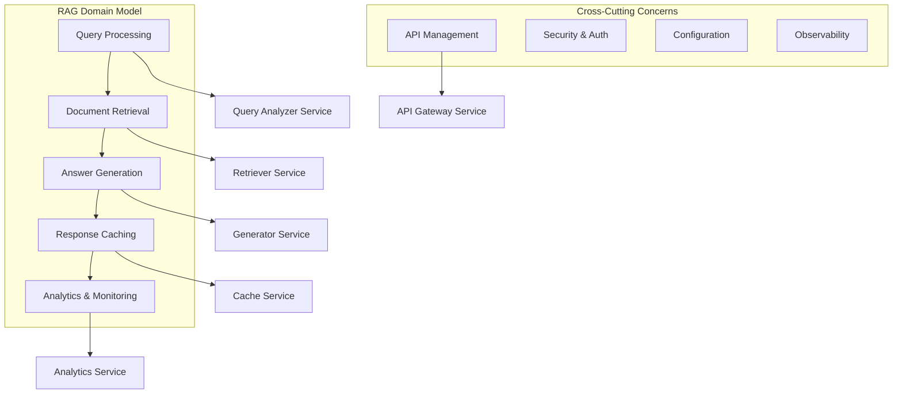
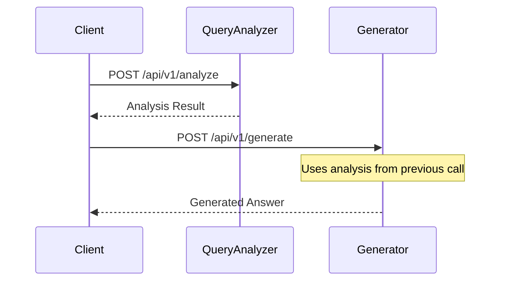
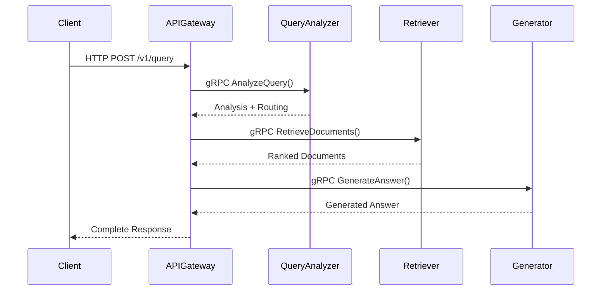
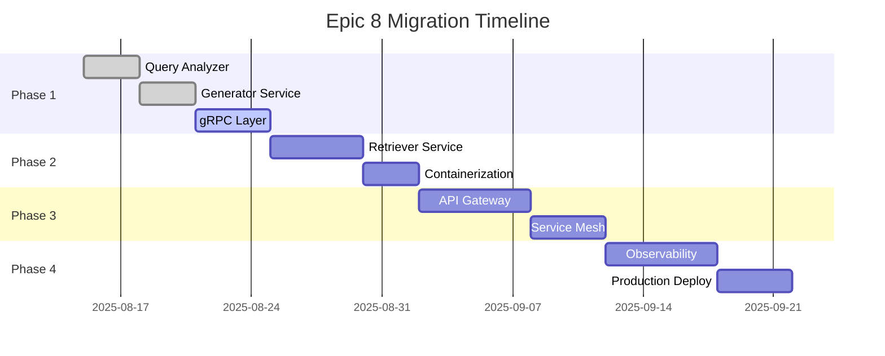

# Epic 8: Microservices Architecture - Cloud-Native Multi-Model RAG Platform

**Version**: 1.0  
**Date**: August 21, 2025  
**Status**: Phase 1 Implementation  
**Architecture Pattern**: Component Encapsulation Strategy

---

## Table of Contents

1. [Architecture Overview](#architecture-overview)
2. [Service Decomposition Strategy](#service-decomposition-strategy)
3. [Component Encapsulation Design](#component-encapsulation-design)
4. [Service Boundaries and Responsibilities](#service-boundaries-and-responsibilities)
5. [Communication Patterns](#communication-patterns)
6. [Deployment Architecture](#deployment-architecture)
7. [Data Architecture](#data-architecture)
8. [Security Architecture](#security-architecture)
9. [Observability Architecture](#observability-architecture)
10. [Migration and Evolution Strategy](#migration-and-evolution-strategy)

---

## Architecture Overview

### Design Philosophy

Epic 8 follows a **Component Encapsulation Strategy**, wrapping existing Epic 1 and Epic 2 components into cloud-native microservices. This approach minimizes risk while maximizing deployment flexibility and operational capabilities.

### 6-Service Target Architecture

```
┌─────────────────────────────────────────────────────────────────────────────┐
│                        Epic 8 Cloud-Native Platform                        │
├─────────────────────────────────────────────────────────────────────────────┤
│                                                                             │
│   ┌─────────────┐      ┌─────────────┐      ┌─────────────┐               │
│   │  API        │      │ Analytics   │      │   Cache     │               │
│   │  Gateway    │      │ Service     │      │ Service     │               │
│   │ Service     │      │             │      │ (Redis)     │               │
│   │ (Phase 3)   │      │ (Phase 4)   │      │ (Phase 3)   │               │
│   └──────┬──────┘      └─────────────┘      └─────────────┘               │
│          │                     ▲                    ▲                      │
│          │                     │                    │                      │
│   ┌──────▼──────┐         ┌────┴─────┐         ┌────┴─────┐               │
│   │  Query      │◄────────┤Generator │◄────────┤Retriever │               │
│   │ Analyzer    │  Model  │Service   │ Context │Service   │               │
│   │ Service ✅  │  Rec.   │      ✅  │ Docs    │(Phase 2) │               │
│   └─────────────┘         └──────────┘         └──────────┘               │
│                                                                             │
└─────────────────────────────────────────────────────────────────────────────┘

Legend:
✅ Implemented (Phase 1)
📋 Planned (Phase 2-4)
```

### Implementation Status

| Service | Status | Phase | Epic Component | Port | Protocol |
|---------|--------|-------|----------------|------|----------|
| **Query Analyzer** | ✅ Complete | 1.1 | Epic1QueryAnalyzer | 8080 | HTTP/REST |
| **Generator Service** | ✅ Complete | 1.2 | Epic1AnswerGenerator | 8081 | HTTP/REST |
| **Retriever Service** | 📋 Planned | 2.1 | ModularUnifiedRetriever | 8082 | HTTP/gRPC |
| **API Gateway** | 📋 Planned | 3.1 | Custom Gateway | 80/443 | HTTP/WebSocket |
| **Cache Service** | 📋 Planned | 3.2 | Redis Cluster | 6379 | Redis Protocol |
| **Analytics Service** | 📋 Planned | 4.1 | Custom Analytics | 8083 | HTTP/gRPC |

---

## Service Decomposition Strategy

### Decomposition Principles

The microservices decomposition follows **Domain-Driven Design** principles with **business capability alignment**:

1. **Single Responsibility**: Each service handles one business domain
2. **Loose Coupling**: Services communicate through well-defined APIs
3. **High Cohesion**: Related functionality grouped within services
4. **Component Encapsulation**: Wrap existing components without modification
5. **Independent Deployment**: Services can be deployed independently

### Service Identification Method



---

## Component Encapsulation Design

### Encapsulation Architecture Pattern

Each microservice follows the **Wrapper Pattern** for component encapsulation:

```
┌─────────────────────────────────────────────────────────────┐
│                   Microservice Layer                        │
├─────────────────────────────────────────────────────────────┤
│  ┌───────────────┐  ┌─────────────────┐  ┌───────────────┐ │
│  │ FastAPI       │  │ Health Checks   │  │ Prometheus    │ │
│  │ REST Endpoints│  │ & Monitoring    │  │ Metrics       │ │
│  └───────────────┘  └─────────────────┘  └───────────────┘ │
├─────────────────────────────────────────────────────────────┤
│                Service Wrapper Layer                        │
├─────────────────────────────────────────────────────────────┤
│  ┌───────────────┐  ┌─────────────────┐  ┌───────────────┐ │
│  │ Request       │  │ Configuration   │  │ Error         │ │
│  │ Translation   │  │ Management      │  │ Handling      │ │
│  └───────────────┘  └─────────────────┘  └───────────────┘ │
├─────────────────────────────────────────────────────────────┤
│                Epic Component Layer                         │
├─────────────────────────────────────────────────────────────┤
│  ┌───────────────────────────────────────────────────────┐ │
│  │              Original Epic Components                  │ │
│  │        (Epic1QueryAnalyzer, Epic1AnswerGenerator)     │ │
│  │                   UNCHANGED                            │ │
│  └───────────────────────────────────────────────────────┘ │
└─────────────────────────────────────────────────────────────┘
```

### Benefits of Encapsulation Strategy

1. **Risk Mitigation**: No changes to proven Epic 1/2 components (95.1% success rate preserved)
2. **Rapid Development**: Services implemented in days, not weeks
3. **Testing Confidence**: Existing component tests validate core functionality
4. **Migration Flexibility**: Easy rollback to monolithic deployment
5. **Consistent Behavior**: Same business logic, different deployment model

---

## Service Boundaries and Responsibilities

### Query Analyzer Service

**Boundary**: Query intelligence and routing decisions  
**Primary Responsibility**: Analyze query complexity and recommend optimal processing strategies

```
┌─────────────────────────────────────────────────────────────┐
│                 Query Analyzer Service                      │
├─────────────────────────────────────────────────────────────┤
│ Core Responsibilities:                                      │
│ • Query complexity classification (simple/medium/complex)   │
│ • Feature extraction (linguistic, structural, semantic)    │
│ • Model recommendation based on complexity and strategy    │
│ • Cost estimation for different model routes              │
│ • Performance analytics for query patterns                │
├─────────────────────────────────────────────────────────────┤
│ Encapsulated Components:                                    │
│ • Epic1QueryAnalyzer (main orchestrator)                  │
│ • FeatureExtractor (linguistic analysis)                  │
│ • ComplexityClassifier (ML-based classification)          │
│ • ModelRecommender (strategy-based recommendation)        │
├─────────────────────────────────────────────────────────────┤
│ Service Boundaries:                                         │
│ • Ingress: Raw queries with optional context              │
│ • Egress: Complexity analysis + model recommendations     │
│ • Dependencies: None (stateless analysis)                 │
│ • Scaling Pattern: CPU-bound, horizontal scaling          │
└─────────────────────────────────────────────────────────────┘
```

### Generator Service

**Boundary**: Multi-model answer generation with intelligent routing  
**Primary Responsibility**: Generate answers using optimal model selection and cost management

```
┌─────────────────────────────────────────────────────────────┐
│                    Generator Service                        │
├─────────────────────────────────────────────────────────────┤
│ Core Responsibilities:                                      │
│ • Multi-model answer generation (4+ LLM providers)        │
│ • Adaptive routing based on query complexity              │
│ • Cost tracking and budget management                     │
│ • Fallback mechanisms for model failures                  │
│ • Response quality assessment and confidence scoring      │
├─────────────────────────────────────────────────────────────┤
│ Encapsulated Components:                                    │
│ • Epic1AnswerGenerator (multi-model orchestrator)         │
│ • LLMAdapters (Ollama, OpenAI, Mistral, HuggingFace)     │
│ • AdaptiveRouter (strategy-based routing)                 │
│ • CostTracker (enterprise cost monitoring)                │
│ • PromptBuilder & ResponseParser (formatting)             │
├─────────────────────────────────────────────────────────────┤
│ Service Boundaries:                                         │
│ • Ingress: Query + context docs + routing preferences     │
│ • Egress: Generated answer + metadata + cost information  │
│ • Dependencies: External LLM APIs (OpenAI, Mistral)       │
│ • Scaling Pattern: I/O-bound, connection pool scaling     │
└─────────────────────────────────────────────────────────────┘
```

### Retriever Service (Planned - Phase 2)

**Boundary**: Document retrieval and ranking  
**Primary Responsibility**: Retrieve and rank relevant documents from knowledge base

```
┌─────────────────────────────────────────────────────────────┐
│                   Retriever Service                         │
├─────────────────────────────────────────────────────────────┤
│ Core Responsibilities:                                      │
│ • Hybrid retrieval (dense + sparse methods)               │
│ • Document ranking and reranking                          │
│ • Result fusion and optimization                          │
│ • Retrieval quality analytics                             │
├─────────────────────────────────────────────────────────────┤
│ Encapsulated Components:                                    │
│ • ModularUnifiedRetriever (Epic 2 component)              │
│ • FAISSIndex (vector similarity search)                   │
│ • BM25Retriever (sparse keyword search)                   │
│ • SemanticReranker (cross-encoder reranking)              │
├─────────────────────────────────────────────────────────────┤
│ Service Boundaries:                                         │
│ • Ingress: Search queries with parameters                 │
│ • Egress: Ranked document list with scores               │
│ • Dependencies: Vector storage, document index            │
│ • Scaling Pattern: Memory-bound, read replica scaling     │
└─────────────────────────────────────────────────────────────┘
```

### API Gateway Service (Planned - Phase 3)

**Boundary**: External API management and routing  
**Primary Responsibility**: Request routing, authentication, and traffic management

```
┌─────────────────────────────────────────────────────────────┐
│                   API Gateway Service                       │
├─────────────────────────────────────────────────────────────┤
│ Core Responsibilities:                                      │
│ • Request routing to appropriate services                  │
│ • API authentication and authorization                     │
│ • Rate limiting and traffic shaping                       │
│ • Request/response transformation                          │
│ • API versioning and backward compatibility               │
├─────────────────────────────────────────────────────────────┤
│ Implementation Components:                                  │
│ • Kong/Ambassador/Istio Gateway                           │
│ • Rate limiting middleware                                 │
│ • Authentication plugins                                   │
│ • Circuit breaker implementation                           │
├─────────────────────────────────────────────────────────────┤
│ Service Boundaries:                                         │
│ • Ingress: External HTTP/WebSocket requests               │
│ • Egress: Routed requests to internal services           │
│ • Dependencies: All internal services                     │
│ • Scaling Pattern: Network-bound, load balancer scaling   │
└─────────────────────────────────────────────────────────────┘
```

---

## Communication Patterns

### Current Implementation (Phase 1)

**HTTP REST Communication**:
- **Protocol**: HTTP/1.1 with JSON payload
- **Service Discovery**: Static configuration (host:port)
- **Load Balancing**: None (single instance per service)
- **Error Handling**: HTTP status codes + structured error responses



### Target Implementation (Phase 1.3+)

**gRPC Communication with HTTP Fallback**:
- **Internal**: gRPC with protobuf for performance
- **External**: HTTP REST for compatibility
- **Service Discovery**: Kubernetes DNS + service mesh
- **Load Balancing**: Service mesh (Istio/Linkerd)
- **Error Handling**: gRPC status codes + structured errors



### Communication Protocols by Phase

| Phase | Internal Protocol | External Protocol | Service Discovery | Load Balancing |
|-------|------------------|-------------------|-------------------|----------------|
| **1.1-1.2** | HTTP REST | HTTP REST | Static Config | None |
| **1.3** | gRPC + HTTP | HTTP REST | Static Config | Round Robin |
| **2-3** | gRPC | HTTP REST | Kubernetes DNS | Service Mesh |
| **4** | gRPC | HTTP REST + WebSocket | Service Mesh | Advanced LB |

---

## Deployment Architecture

### Container Architecture

Each service follows **multi-stage Docker builds** with security best practices:

```dockerfile
# Example: Query Analyzer Service Dockerfile
FROM python:3.11-slim as builder
WORKDIR /build
COPY requirements.txt .
RUN pip install --no-cache-dir -r requirements.txt

FROM python:3.11-slim as runtime
RUN adduser --disabled-password --gecos '' appuser
WORKDIR /app
COPY --from=builder /usr/local/lib/python3.11/site-packages /usr/local/lib/python3.11/site-packages
COPY --chown=appuser:appuser app/ ./app/
USER appuser
EXPOSE 8080
CMD ["python", "-m", "uvicorn", "app.main:app", "--host", "0.0.0.0", "--port", "8080"]
```

### Kubernetes Deployment Model

**Deployment Strategy**: Rolling updates with zero-downtime
**Resource Management**: Requests and limits for CPU/memory
**Scaling**: Horizontal Pod Autoscaling (HPA) based on CPU/custom metrics

```yaml
# Example: Query Analyzer Deployment
apiVersion: apps/v1
kind: Deployment
metadata:
  name: query-analyzer
  labels:
    app: query-analyzer
    version: v1
spec:
  replicas: 3
  selector:
    matchLabels:
      app: query-analyzer
  template:
    metadata:
      labels:
        app: query-analyzer
        version: v1
    spec:
      containers:
      - name: query-analyzer
        image: query-analyzer:1.0
        ports:
        - containerPort: 8080
        resources:
          requests:
            cpu: "500m"
            memory: "1Gi"
          limits:
            cpu: "1000m"
            memory: "2Gi"
        livenessProbe:
          httpGet:
            path: /health/live
            port: 8080
          initialDelaySeconds: 30
          periodSeconds: 10
        readinessProbe:
          httpGet:
            path: /health/ready
            port: 8080
          initialDelaySeconds: 5
          periodSeconds: 5
```

### Cloud Provider Support

**Multi-Cloud Strategy**: Kubernetes-native deployment supporting:

| Provider | Kubernetes | Load Balancer | Storage | Monitoring |
|----------|------------|---------------|---------|------------|
| **AWS** | EKS | ALB/NLB | EBS/EFS | CloudWatch |
| **GCP** | GKE | Cloud Load Balancer | Persistent Disk | Cloud Monitoring |
| **Azure** | AKS | Application Gateway | Azure Disk | Azure Monitor |
| **Local** | K3s/minikube | MetalLB | Local Storage | Prometheus |

---

## Data Architecture

### Data Distribution Strategy

```
┌─────────────────────────────────────────────────────────────┐
│                     Data Architecture                       │
├─────────────────────────────────────────────────────────────┤
│                                                             │
│ ┌───────────────┐  ┌─────────────┐  ┌─────────────────────┐│
│ │   PostgreSQL  │  │    Redis    │  │   Object Storage    ││
│ │   (Metadata)  │  │  (Cache)    │  │  (Documents/Models) ││
│ │               │  │             │  │                     ││
│ │ • Configs     │  │ • Sessions  │  │ • PDF Files        ││
│ │ • User Data   │  │ • Responses │  │ • Model Artifacts  ││
│ │ • Analytics   │  │ • Rate Limits│  │ • Vector Indices   ││
│ └───────────────┘  └─────────────┘  └─────────────────────┘│
│        │                 │                      │          │
│        └─────────────────┼──────────────────────┘          │
│                          │                                 │
│ ┌────────────────────────▼─────────────────────────────────┐│
│ │              Service Data Access Layer                   ││
│ │                                                         ││
│ │ Query Analyzer: Configuration only (stateless)         ││
│ │ Generator: Cost tracking, model registry               ││
│ │ Retriever: Vector indices, search cache               ││
│ │ API Gateway: Rate limiting, authentication             ││
│ │ Analytics: Metrics aggregation, reporting              ││
│ └─────────────────────────────────────────────────────────┘│
└─────────────────────────────────────────────────────────────┘
```

### Data Consistency Model

**Event-Driven Architecture** with eventual consistency for analytics:
- **Strong Consistency**: User requests, configuration changes
- **Eventual Consistency**: Analytics data, cached responses
- **CAP Theorem**: Partition tolerance + availability over consistency

---

## Security Architecture

### Defense in Depth Strategy

```
┌─────────────────────────────────────────────────────────────┐
│                    Security Architecture                     │
├─────────────────────────────────────────────────────────────┤
│                                                             │
│ ┌─────────────────────────────────────────────────────────┐ │
│ │              Network Security Layer                     │ │
│ │ • Network Policies (Kubernetes)                        │ │
│ │ • Service Mesh mTLS (Istio/Linkerd)                   │ │
│ │ • Firewall Rules (Cloud Provider)                      │ │
│ └─────────────────────────────────────────────────────────┘ │
│ ┌─────────────────────────────────────────────────────────┐ │
│ │             Application Security Layer                  │ │
│ │ • API Authentication (Bearer Tokens)                   │ │
│ │ • Input Validation (Pydantic Schemas)                 │ │
│ │ • Rate Limiting (Per-client)                          │ │
│ │ • CORS Policies                                        │ │
│ └─────────────────────────────────────────────────────────┘ │
│ ┌─────────────────────────────────────────────────────────┐ │
│ │               Container Security Layer                  │ │
│ │ • Non-root User Containers                             │ │
│ │ • Image Vulnerability Scanning                         │ │
│ │ • Resource Limits & Quotas                            │ │
│ │ • Security Contexts                                    │ │
│ └─────────────────────────────────────────────────────────┘ │
│ ┌─────────────────────────────────────────────────────────┐ │
│ │                Data Security Layer                      │ │
│ │ • Secrets Management (Kubernetes Secrets)             │ │
│ │ • Encryption at Rest (Cloud Provider)                 │ │
│ │ • Encryption in Transit (TLS 1.3)                     │ │
│ │ • Data Classification & Access Control                 │ │
│ └─────────────────────────────────────────────────────────┘ │
└─────────────────────────────────────────────────────────────┘
```

### OWASP API Security Top 10 Compliance

| OWASP Risk | Mitigation | Implementation |
|------------|------------|----------------|
| **Broken Object Level Authorization** | Service boundaries | Request validation per service |
| **Broken User Authentication** | Bearer tokens | API key authentication |
| **Excessive Data Exposure** | Response filtering | Minimal response payloads |
| **Lack of Resources & Rate Limiting** | Rate limiting | Per-client quotas |
| **Broken Function Level Authorization** | Role-based access | Service-level permissions |
| **Mass Assignment** | Schema validation | Pydantic strict schemas |
| **Security Misconfiguration** | Security scanning | Automated security tests |
| **Injection** | Input validation | Parameterized queries |
| **Improper Assets Management** | API documentation | Swagger/OpenAPI specs |
| **Insufficient Logging & Monitoring** | Structured logging | Correlation IDs, metrics |

---

## Observability Architecture

### Three Pillars of Observability

```
┌─────────────────────────────────────────────────────────────────┐
│                 Observability Architecture                      │
├─────────────────────────────────────────────────────────────────┤
│                                                                 │
│ ┌─────────────┐    ┌─────────────┐    ┌─────────────────────┐  │
│ │   Metrics   │    │   Traces    │    │       Logs          │  │
│ │             │    │             │    │                     │  │
│ │ Prometheus  │    │   Jaeger    │    │  Structured JSON    │  │
│ │ - Counters  │    │ - Request   │    │  - Correlation IDs  │  │
│ │ - Gauges    │    │   Flows     │    │  - Error Context    │  │
│ │ - Histograms│    │ - Latency   │    │  - Business Events  │  │
│ │ - Summaries │    │   Tracing   │    │  - Debug Info       │  │
│ └─────────────┘    └─────────────┘    └─────────────────────┘  │
│        │                   │                      │             │
│        └───────────────────┼──────────────────────┘             │
│                            │                                    │
│ ┌──────────────────────────▼─────────────────────────────────┐  │
│ │                 Grafana Dashboard                          │  │
│ │                                                            │  │
│ │ • Service Health Overview                                  │  │
│ │ • Performance Metrics (Latency, Throughput)              │  │
│ │ • Business Metrics (Complexity Distribution, Costs)       │  │
│ │ • Error Rates and Alert Status                            │  │
│ │ • Resource Utilization (CPU, Memory, Network)            │  │
│ └────────────────────────────────────────────────────────────┘  │
└─────────────────────────────────────────────────────────────────┘
```

### Service-Level Indicators (SLIs) & Objectives (SLOs)

| Service | SLI | SLO Target | Measurement |
|---------|-----|------------|-------------|
| **Query Analyzer** | Response latency | <50ms P95 | Histogram |
| **Query Analyzer** | Availability | 99.9% | Success rate |
| **Generator** | Response latency | <2s P95 | Histogram |
| **Generator** | Cost accuracy | <5% estimation error | Counter |
| **Overall System** | End-to-end latency | <3s P95 | Distributed tracing |
| **Overall System** | Error rate | <1% | Error counter ratio |

---

## Migration and Evolution Strategy

### Migration Phases



### Rollback Strategy

**Zero-Risk Deployment** with immediate rollback capability:

1. **Configuration Rollback**: Change service type in configuration
2. **Traffic Switching**: Blue-green deployment with traffic percentages  
3. **Data Consistency**: Stateless services enable immediate rollback
4. **Component Preservation**: Original Epic components remain operational

### Evolution Path

**Service Evolution Strategy**:
- **Phase 1**: HTTP REST microservices (current)
- **Phase 2**: gRPC + Kubernetes orchestration
- **Phase 3**: Service mesh + advanced routing
- **Phase 4**: Full observability + multi-cloud

**Technology Evolution**:
- **Languages**: Python → Go/Rust for performance-critical services
- **Communication**: HTTP → gRPC → GraphQL federation
- **Storage**: Single DB → Event sourcing + CQRS
- **AI/ML**: Static models → Dynamic model serving + A/B testing

---

## Conclusion

Epic 8 microservices architecture successfully transforms the monolithic RAG system into a cloud-native platform while preserving the proven reliability of Epic 1/2 components. The **Component Encapsulation Strategy** minimizes risk while maximizing deployment flexibility, operational capabilities, and Swiss engineering standards.

**Key Architectural Principles**:
- ✅ **Risk Mitigation**: Zero changes to proven components
- ✅ **Independent Scaling**: Service-specific resource optimization
- ✅ **Technology Evolution**: Gradual migration to cloud-native technologies
- ✅ **Operational Excellence**: Comprehensive observability and monitoring
- ✅ **Swiss Quality**: Reliability, efficiency, and precision throughout

The architecture is designed for **Swiss tech market requirements**: demonstrating cloud-native expertise, operational excellence, and production-ready system design capabilities essential for ML Engineer positions.

---

*This architecture document serves as the blueprint for Epic 8 implementation, covering current status and future evolution strategy.*