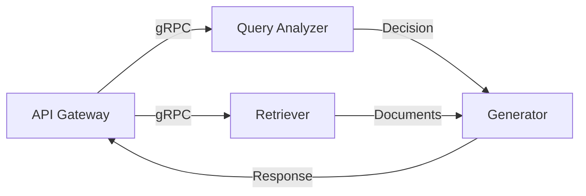

# Epic 8: Cloud-Native Multi-Model RAG Platform - Implementation Guidelines

**Version**: 1.0  
**Status**: APPROVED  
**Last Updated**: 2025-01-29  
**Purpose**: Guide creation of Detailed Design Document (DDD) during implementation

---

## 📋 Overview

This document provides guidelines for implementing Epic 8 and creating the accompanying Detailed Design Document (DDD). The DDD should evolve throughout implementation, capturing design decisions, technical details, and lessons learned.

### Document Structure Requirements

The DDD should follow this structure:
1. **Executive Summary**: High-level overview and current status
2. **Architecture Design**: Detailed component design and interactions
3. **Implementation Details**: Code structure, patterns, and algorithms
4. **Configuration Management**: All configuration schemas and examples
5. **Data Models**: Complete data structures and schemas
6. **API Specifications**: OpenAPI/AsyncAPI definitions
7. **Deployment Architecture**: Infrastructure as Code details
8. **Security Design**: Security controls and implementations
9. **Performance Optimizations**: Caching, scaling, and tuning
10. **Operational Procedures**: Runbooks and troubleshooting

---

## 🏗️ Phase 1: Multi-Model Enhancement (Week 1)

### Design Documentation Requirements

#### 1.1 Query Analyzer Design

**Document in DDD**:
```markdown
## Query Analyzer Service Design

### Architecture Pattern
- Strategy Pattern for pluggable analyzers
- Factory Pattern for analyzer creation
- Observer Pattern for metrics collection

### Class Hierarchy
\```python
AbstractQueryAnalyzer (ABC)
├── RuleBasedAnalyzer
├── MLBasedAnalyzer
│   ├── ComplexityClassifier
│   └── IntentDetector
└── HybridAnalyzer
\```

### Feature Extraction Pipeline
1. Tokenization and preprocessing
2. Feature vector construction
3. Model inference
4. Confidence scoring
```

**Implementation Checklist**:
- [ ] Define feature extraction schema
- [ ] Document training data requirements
- [ ] Specify model versioning strategy
- [ ] Create performance benchmarks
- [ ] Design A/B testing integration

**Key Design Decisions to Document**:
1. **Feature Selection Rationale**: Why specific features were chosen
2. **Model Architecture**: Classifier type and hyperparameters
3. **Threshold Tuning**: How complexity boundaries were determined
4. **Performance Tradeoffs**: Accuracy vs latency decisions

#### 1.2 Model Adapter Framework

**Document Structure**:
```python
# Base adapter interface design
class ModelAdapter(ABC):
    """
    Document:
    - Interface contract
    - Required methods
    - Error handling strategy
    - Retry policies
    - Cost calculation method
    """
    
    @abstractmethod
    async def generate(self, prompt: str, context: str, config: dict) -> GenerationResult:
        """Include: timeout handling, streaming support, token limits"""
        
    @abstractmethod
    async def health_check(self) -> HealthStatus:
        """Include: health criteria, recovery actions"""
```

**Adapter Implementation Guidelines**:

1. **Ollama Adapter** (Self-hosted):
   ```python
   # Document these aspects:
   - Connection pooling strategy
   - Model loading optimization
   - GPU memory management
   - Batch processing capability
   ```

2. **API Adapters** (OpenAI, Mistral, Anthropic):
   ```python
   # Document these aspects:
   - Rate limiting implementation
   - API key rotation
   - Cost tracking precision
   - Fallback strategies
   ```

**Configuration Schema Design**:
```yaml
# Document each configuration option
model_config:
  ollama:
    endpoint: "http://ollama-service:11434"
    models:
      fast:
        name: "llama3.2:3b"
        max_tokens: 2048
        temperature: 0.7
        timeout: 30s
        gpu_memory_fraction: 0.5
  
  openai:
    models:
      premium:
        name: "gpt-4-turbo"
        max_tokens: 4096
        temperature: 0.3
        timeout: 60s
        rate_limit: 100  # requests per minute
```

### Testing Strategy Documentation

**Unit Test Design**:
```python
# Document test categories and coverage targets
test_categories = {
    "interface_compliance": "100% coverage of adapter methods",
    "error_handling": "All exception types tested",
    "performance": "Latency and throughput benchmarks",
    "cost_accuracy": "Cost calculation within 5% error"
}
```

---

## 🐳 Phase 2: Containerization (Week 2)

### Container Design Documentation

#### 2.1 Docker Image Architecture

**Multi-stage Build Strategy**:
```dockerfile
# Document each stage's purpose
# Stage 1: Dependencies
FROM python:3.11-slim as deps
# Document: Why specific base image chosen

# Stage 2: Builder
FROM deps as builder
# Document: Build optimizations applied

# Stage 3: Runtime
FROM python:3.11-slim
# Document: Security hardening steps
```

**Image Optimization Checklist**:
- [ ] Document base image selection rationale
- [ ] List all installed packages with justification
- [ ] Specify security scanning integration
- [ ] Define layer caching strategy
- [ ] Document size reduction techniques

#### 2.2 Service Decomposition

**Microservice Boundaries**:
```yaml
services:
  api-gateway:
    responsibilities:
      - Request routing
      - Authentication
      - Rate limiting
    dependencies:
      - All internal services
    scaling_strategy: "CPU-based HPA"
    
  query-analyzer:
    responsibilities:
      - Complexity analysis
      - Feature extraction
      - Model selection
    dependencies:
      - None (stateless)
    scaling_strategy: "Request-based HPA"
```

**Inter-service Communication Design**:


### Kubernetes Manifest Design

**Resource Specifications**:
```yaml
# Document resource calculation methodology
resources:
  requests:
    memory: "2Gi"  # Based on: average heap + 20% buffer
    cpu: "1"       # Based on: load test p50 usage
  limits:
    memory: "4Gi"  # Based on: peak usage + 50% buffer
    cpu: "2"       # Based on: burst capacity needs
```

**Health Check Design**:
```yaml
# Document health check criteria
livenessProbe:
  httpGet:
    path: /health/live
    port: 8080
  initialDelaySeconds: 30  # Why: Model loading time
  periodSeconds: 10
  failureThreshold: 3      # Why: Avoid cascading restarts

readinessProbe:
  httpGet:
    path: /health/ready
    port: 8080
  initialDelaySeconds: 10
  periodSeconds: 5
  successThreshold: 1
```

---

## 🎼 Phase 3: Orchestration (Week 3)

### Helm Chart Design

#### 3.1 Chart Architecture

**Values Schema Documentation**:
```yaml
# values.schema.json
{
  "$schema": "http://json-schema.org/draft-07/schema#",
  "type": "object",
  "required": ["global", "services"],
  "properties": {
    "global": {
      "type": "object",
      "description": "Global configuration affecting all services"
    }
  }
}
```

**Template Organization**:
```
charts/rag-platform/
├── Chart.yaml           # Document: versioning strategy
├── values.yaml          # Document: default rationale
├── values.schema.json   # Document: validation rules
├── templates/
│   ├── NOTES.txt       # Document: post-install steps
│   ├── _helpers.tpl    # Document: template functions
│   ├── api-gateway/    # Document: service-specific templates
│   └── ...
└── tests/              # Document: helm test strategy
```

#### 3.2 Scaling Strategy Design

**HPA Configuration Design**:
```yaml
# Document scaling decision tree
scaling_rules:
  api_gateway:
    min_replicas: 3      # HA requirement
    max_replicas: 20     # Cost constraint
    metrics:
      - type: cpu
        target: 70       # Why: Response time correlation
      - type: requests_per_second
        target: 100      # Why: Capacity planning
        
  generator_service:
    min_replicas: 2
    max_replicas: 10
    metrics:
      - type: custom/queue_depth
        target: 50       # Why: Prevent timeouts
```

**VPA Recommendations**:
```yaml
# Document VPA learning period and update policy
vpa_config:
  updateMode: "Auto"
  resourcePolicy:
    containerPolicies:
    - containerName: generator
      maxAllowed:
        cpu: 4
        memory: 8Gi     # Why: Model memory requirements
```

### Service Mesh Integration

**Traffic Management Design**:
```yaml
# Istio VirtualService design
spec:
  http:
  - match:
    - headers:
        x-model-preference:
          exact: premium
    route:
    - destination:
        host: generator
        subset: gpt4
      weight: 100
  - route:  # Default route
    - destination:
        host: generator
        subset: balanced
```

---

## 🛡️ Phase 4: Production Hardening (Week 4)

### Monitoring Architecture

#### 4.1 Metrics Design

**Custom Metrics Definition**:
```python
# Document each metric's purpose and calculation
metrics = {
    "rag_query_complexity": {
        "type": "histogram",
        "buckets": [0.1, 0.3, 0.5, 0.7, 0.9],
        "labels": ["model_selected", "user_tier"],
        "description": "Distribution of query complexity scores"
    },
    "rag_model_cost_dollars": {
        "type": "counter",
        "labels": ["model", "status"],
        "description": "Cumulative cost per model"
    }
}
```

**Dashboard Design Specifications**:
```json
{
  "dashboard": "RAG Platform Overview",
  "panels": [
    {
      "title": "Request Flow",
      "type": "graph",
      "metrics": ["rate(http_requests_total[5m])"],
      "description": "Document panel purpose and alerts"
    }
  ]
}
```

#### 4.2 Security Implementation

**Network Policy Design**:
```yaml
# Document security zones and communication rules
apiVersion: networking.k8s.io/v1
kind: NetworkPolicy
metadata:
  name: generator-isolation
spec:
  podSelector:
    matchLabels:
      app: generator
  policyTypes:
  - Ingress
  - Egress
  ingress:
  - from:
    - podSelector:
        matchLabels:
          app: api-gateway
    ports:
    - protocol: TCP
      port: 8080
```

**Secret Management Design**:
```yaml
# Document secret rotation strategy
external_secrets:
  openai_api_key:
    backend: "aws-secrets-manager"
    rotation: "30d"
    notification: "slack-security"
  
  mistral_api_key:
    backend: "hashicorp-vault"
    rotation: "30d"
    path: "secret/rag/mistral"
```

### Operational Procedures

#### 4.1 Runbook Structure

**Template for Each Procedure**:
```markdown
## Procedure: [Name]

### When to Use
- Specific triggers and symptoms

### Prerequisites
- Required access levels
- Tools needed
- Pre-checks to perform

### Steps
1. Step with specific commands
2. Validation checkpoints
3. Rollback procedures

### Post-Procedure
- Verification steps
- Documentation updates
- Incident report requirements
```

#### 4.2 Disaster Recovery Design

**Backup Strategy**:
```yaml
backup_policy:
  databases:
    postgresql:
      schedule: "0 2 * * *"  # Daily at 2 AM
      retention: "30d"
      method: "pg_dump with compression"
      
  vector_indices:
    faiss:
      schedule: "0 */6 * * *"  # Every 6 hours
      retention: "7d"
      method: "Volume snapshots"
```

---

## 📝 Documentation Standards

### Code Documentation

**Service Documentation Template**:
```python
"""
Service: Query Analyzer
Version: 1.0.0
Owner: ML Platform Team

Description:
    Detailed service description including purpose,
    dependencies, and critical business logic.

Configuration:
    List all environment variables and their purposes.

API Endpoints:
    Document all endpoints with examples.

Monitoring:
    Key metrics and SLOs for this service.
"""
```

### API Documentation

**OpenAPI Specification Requirements**:
```yaml
openapi: 3.0.0
info:
  title: RAG Platform API
  version: 1.0.0
  description: |
    Document:
    - Authentication methods
    - Rate limiting details
    - Error response formats
    - Versioning strategy

paths:
  /query:
    post:
      summary: Process RAG query
      description: |
        Document:
        - Request/response examples
        - Performance expectations
        - Cost implications
```

### Configuration Documentation

**Environment-Specific Documentation**:
```yaml
environments:
  development:
    description: "Local development settings"
    considerations:
      - "Reduced resource limits"
      - "Mock external services"
      - "Verbose logging enabled"
      
  production:
    description: "Production settings"
    considerations:
      - "Full resource allocation"
      - "Real API endpoints"
      - "Structured logging only"
```

---

## 🔄 Continuous Improvement

### Implementation Review Checkpoints

**Weekly Review Template**:
```markdown
## Week N Review

### Completed
- List of implemented features
- Design decisions made
- Problems solved

### Challenges
- Technical obstacles
- Design changes required
- Resource constraints

### Next Steps
- Upcoming implementations
- Required decisions
- Risk mitigations
```

### Design Document Updates

**Update Triggers**:
1. Major design decision changes
2. Performance optimization discoveries
3. Security vulnerability findings
4. Operational lessons learned
5. Cost optimization opportunities

**Version Control**:
```bash
docs/
├── design/
│   ├── v1.0-initial-design.md
│   ├── v1.1-scaling-updates.md
│   └── v2.0-current.md
└── decisions/
    ├── ADR-001-model-selection.md
    ├── ADR-002-caching-strategy.md
    └── ADR-003-security-controls.md
```

---

## 🎯 Success Metrics for Implementation

### Technical Metrics
- [ ] All services containerized and deployable
- [ ] Kubernetes manifests validated and tested
- [ ] Monitoring dashboards operational
- [ ] CI/CD pipeline fully automated

### Documentation Metrics
- [ ] DDD complete with all sections
- [ ] API documentation 100% coverage
- [ ] Runbooks tested by ops team
- [ ] Architecture diagrams current

### Quality Metrics
- [ ] Test coverage >90%
- [ ] Security scan passed
- [ ] Performance targets met
- [ ] Cost within budget

---

**Living Document Notice**: This implementation guide should be updated throughout the Epic 8 implementation. Each phase completion should trigger a documentation review and update cycle.

**Next Steps**: Begin Phase 1 implementation and create initial DDD structure based on this guide.