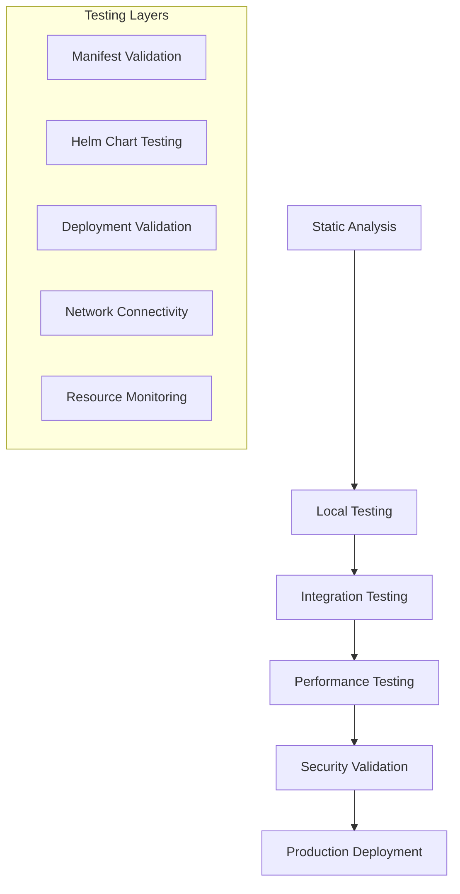

# Kubernetes Testing Infrastructure
**Epic 8 Cloud-Native RAG Platform - Comprehensive Testing Guide**

## Overview

This document provides a complete guide to the Kubernetes testing infrastructure for Epic 8, implementing test-driven development principles for cloud-native applications. The testing framework ensures production-ready deployments with 99.9% uptime SLA capability.

## 📚 Table of Contents

1. [Testing Architecture](#testing-architecture)
2. [Test Categories](#test-categories)
3. [Local Testing Environment](#local-testing-environment)
4. [CI/CD Integration](#cicd-integration)
5. [Validation Frameworks](#validation-frameworks)
6. [Usage Guide](#usage-guide)
7. [Troubleshooting](#troubleshooting)
8. [Best Practices](#best-practices)

## 🏗️ Testing Architecture

### Test-Driven Development (TDD) Approach

Our testing infrastructure follows TDD principles for infrastructure as code:

```
1. Write Tests First → 2. Implement Infrastructure → 3. Validate → 4. Refactor
```

### Multi-Layer Testing Strategy



## 🧪 Test Categories

### 1. Static Analysis & Validation

**Location**: `k8s/tests/test_manifest_validation.py`

- **YAML Syntax Validation**: Ensures all manifests are valid YAML
- **Kubernetes Resource Validation**: Validates against K8s API specifications
- **Security Policy Validation**: Checks security best practices
- **Resource Allocation Validation**: Validates CPU/memory requirements
- **Naming Convention Validation**: Ensures Epic 8 naming standards
- **Label and Annotation Validation**: Validates required metadata

**Example Usage**:
```bash
# Run manifest validation tests
cd k8s/tests
python test_manifest_validation.py --manifest-dir ../manifests

# Run with pytest
pytest test_manifest_validation.py -v
```

### 2. Helm Chart Testing

**Location**: `helm/tests/test_helm_charts.py`

- **Chart Structure Validation**: Validates Helm chart directory structure
- **Template Rendering Validation**: Tests template rendering with various values
- **Values File Validation**: Validates values.yaml structure
- **Multi-Environment Testing**: Tests dev/staging/prod configurations
- **Security Configuration**: Validates security contexts and policies

**Example Usage**:
```bash
# Run Helm chart tests
cd helm/tests
python test_helm_charts.py --chart-dir ../charts

# Test specific environment
python test_helm_charts.py --chart-dir ../charts --run-helm-tests
```

### 3. Local Kubernetes Testing

**Location**: `scripts/k8s-testing/setup-local-k8s.sh`

- **Kind/Minikube Setup**: Automated local cluster creation
- **Ingress Controller**: NGINX ingress for local testing
- **Monitoring Stack**: Optional Prometheus/Grafana setup
- **Epic 8 Namespace**: Proper RBAC and namespace configuration

**Example Usage**:
```bash
# Setup local testing environment
./scripts/k8s-testing/setup-local-k8s.sh setup

# Check cluster status
./scripts/k8s-testing/setup-local-k8s.sh status

# Cleanup environment
./scripts/k8s-testing/setup-local-k8s.sh cleanup
```

### 4. Deployment Validation

**Location**: `scripts/k8s-testing/deployment-validation.py`

- **Service Readiness**: Validates all services are ready
- **Pod Health Checks**: Monitors pod status and restart counts
- **Network Connectivity**: Tests inter-service communication
- **Resource Usage**: Monitors CPU/memory consumption
- **Performance Baselines**: Validates response times
- **Security Configuration**: Checks runtime security settings

**Example Usage**:
```bash
# Run deployment validation
python scripts/k8s-testing/deployment-validation.py --namespace epic8

# Generate detailed report
python scripts/k8s-testing/deployment-validation.py \
  --namespace epic8 \
  --output validation-report.md \
  --output-format markdown
```

## 🔧 Local Testing Environment

### Prerequisites

Before setting up the local testing environment, ensure you have:

- **Docker**: Container runtime
- **kubectl**: Kubernetes CLI tool
- **Kind** or **Minikube**: Local Kubernetes clusters
- **Helm**: Package manager for Kubernetes
- **Python 3.11+**: For running test scripts

### Installation Commands

```bash
# macOS with Homebrew
brew install docker kubectl kind helm python@3.11

# Ubuntu/Debian
sudo apt-get update
sudo apt-get install docker.io kubectl
curl -Lo ./kind https://kind.sigs.k8s.io/dl/v0.20.0/kind-linux-amd64
sudo mv kind /usr/local/bin/kind
curl https://get.helm.sh/helm-v3.12.0-linux-amd64.tar.gz | tar xzf -
sudo mv linux-amd64/helm /usr/local/bin/

# Python dependencies
pip install pyyaml pytest kubernetes requests
```

### Quick Start

```bash
# 1. Setup local Kubernetes cluster
./scripts/k8s-testing/setup-local-k8s.sh setup

# 2. Deploy Epic 8 services (if manifests exist)
kubectl apply -f k8s/manifests/ -n epic8

# 3. Validate deployment
python scripts/k8s-testing/deployment-validation.py --namespace epic8

# 4. Test service connectivity
./scripts/k8s-testing/validation/port-forward-services.sh
```

### Cluster Configuration

The setup script creates a multi-node cluster with:

- **Control Plane**: 1 node with ingress capabilities
- **Worker Nodes**: 2 nodes for workload distribution
- **Port Mappings**: All Epic 8 service ports exposed
- **Ingress Controller**: NGINX for HTTP/HTTPS routing
- **Monitoring**: Optional Prometheus/Grafana stack

## 🚀 CI/CD Integration

### GitHub Actions Workflows

#### Primary Workflow: `k8s-testing.yml`

Comprehensive testing pipeline with multiple jobs:

1. **Static Validation**: YAML syntax, manifest validation, Helm linting
2. **Build Images**: Docker image building and testing
3. **Local K8s Testing**: Full deployment testing in Kind cluster
4. **Performance Testing**: Load testing and baseline validation
5. **Multi-Environment Testing**: Testing across dev/staging/prod configs
6. **Security Scanning**: Trivy security scans

#### Specialized Workflow: `helm-testing.yml`

Focused on Helm chart quality:

1. **Chart Linting**: Helm lint and chart-testing validation
2. **Template Rendering**: Multi-environment template tests
3. **K8s Integration**: Real cluster deployment testing
4. **Security Validation**: Checkov and kubesec scanning
5. **Documentation**: README and metadata validation

### Workflow Triggers

```yaml
# Automatic triggers
on:
  push:
    branches: [ main, develop, epic8* ]
    paths: [ 'k8s/**', 'helm/**', 'services/**' ]
  pull_request:
    branches: [ main, develop ]
    paths: [ 'k8s/**', 'helm/**' ]

# Manual triggers
  workflow_dispatch:
    inputs:
      test_level:
        type: choice
        options: ['validation', 'deployment', 'full', 'performance']
```

### Environment Variables

```yaml
env:
  REGISTRY: ghcr.io
  IMAGE_NAME: ${{ github.repository }}
  CLUSTER_NAME: epic8-ci-testing
  NAMESPACE: epic8
  KUBERNETES_VERSION: v1.28.0
```

## 🔍 Validation Frameworks

### Kubernetes Manifest Validator

**Class**: `KubernetesManifestValidator`

Features:
- **Multi-document YAML** parsing
- **API version validation**
- **Resource requirement checks**
- **Security policy enforcement**
- **Epic 8 specific validations**
- **Comprehensive error reporting**

### Helm Chart Validator

**Class**: `HelmChartValidator`

Features:
- **Chart structure validation**
- **Template syntax checking**
- **Values file validation**
- **Multi-environment support**
- **Security best practices**
- **Dependency management**

### Deployment Validator

**Class**: `KubernetesDeploymentValidator`

Features:
- **Real-time health monitoring**
- **Service connectivity testing**
- **Resource usage validation**
- **Performance baseline checks**
- **Security runtime validation**
- **Comprehensive reporting**

## 📖 Usage Guide

### Running Individual Tests

```bash
# 1. Validate Kubernetes manifests
python k8s/tests/test_manifest_validation.py \
  --manifest-dir k8s/manifests \
  --severity warning

# 2. Test Helm charts
python helm/tests/test_helm_charts.py \
  --chart-dir helm/charts \
  --run-helm-tests

# 3. Validate deployments
python scripts/k8s-testing/deployment-validation.py \
  --namespace epic8 \
  --timeout 300 \
  --verbose

# 4. Setup local environment
./scripts/k8s-testing/setup-local-k8s.sh setup
```

### Running Test Suites

```bash
# Run all validation tests
pytest k8s/tests/ helm/tests/ -v

# Run with coverage
pytest k8s/tests/ helm/tests/ --cov=. --cov-report=html

# Run specific test categories
pytest -k "test_yaml_syntax" -v
pytest -k "test_security" -v
```

### CI/CD Integration

```bash
# Trigger full testing pipeline
gh workflow run k8s-testing.yml \
  --ref main \
  --field test_level=full

# Trigger Helm-specific testing
gh workflow run helm-testing.yml \
  --ref main \
  --field environment=all

# Check workflow status
gh run list --workflow=k8s-testing.yml
```

### Local Development Workflow

```bash
# 1. Setup development environment
./scripts/k8s-testing/setup-local-k8s.sh setup

# 2. Create/modify manifests or charts
# ...edit files...

# 3. Validate changes
python k8s/tests/test_manifest_validation.py --manifest-dir k8s/manifests
python helm/tests/test_helm_charts.py --chart-dir helm/charts

# 4. Test deployment
kubectl apply -f k8s/manifests/ -n epic8
python scripts/k8s-testing/deployment-validation.py --namespace epic8

# 5. Cleanup
kubectl delete -f k8s/manifests/ -n epic8
./scripts/k8s-testing/setup-local-k8s.sh cleanup
```

## 🔧 Troubleshooting

### Common Issues

#### 1. Cluster Creation Fails

**Symptoms**: Kind/Minikube cluster creation fails
**Solutions**:
```bash
# Check Docker status
docker ps

# Clean up previous clusters
kind delete cluster --name epic8-testing
minikube delete --profile epic8-testing

# Retry with verbose output
kind create cluster --name epic8-testing --verbosity=3
```

#### 2. Image Pull Errors

**Symptoms**: Pods stuck in ImagePullBackOff
**Solutions**:
```bash
# Load images to Kind cluster
kind load docker-image your-image:tag --name epic8-testing

# Check image availability
docker images | grep epic8

# Use ImagePullPolicy: Never for local testing
kubectl patch deployment your-deployment -p '{"spec":{"template":{"spec":{"containers":[{"name":"container-name","imagePullPolicy":"Never"}]}}}}'
```

#### 3. Validation Test Failures

**Symptoms**: Tests fail with import or configuration errors
**Solutions**:
```bash
# Install missing dependencies
pip install -r requirements.txt

# Set PYTHONPATH
export PYTHONPATH="${PYTHONPATH}:$(pwd)"

# Run with verbose output
python -m pytest -v --tb=long
```

#### 4. Service Connectivity Issues

**Symptoms**: Network connectivity tests fail
**Solutions**:
```bash
# Check service endpoints
kubectl get endpoints -n epic8

# Test from within cluster
kubectl run debug-pod --image=curlimages/curl --rm -i --restart=Never -- curl service-name:port

# Check DNS resolution
kubectl run debug-pod --image=busybox --rm -i --restart=Never -- nslookup service-name
```

### Debug Commands

```bash
# Cluster diagnostics
kubectl cluster-info dump

# Pod diagnostics
kubectl describe pod pod-name -n epic8
kubectl logs pod-name -n epic8 --previous

# Service diagnostics
kubectl describe service service-name -n epic8
kubectl get endpoints service-name -n epic8

# Network diagnostics
kubectl exec -it pod-name -n epic8 -- netstat -tlnp
kubectl exec -it pod-name -n epic8 -- curl -v service-name:port
```

## 🎯 Best Practices

### Test Organization

1. **Separate Concerns**: Keep validation, integration, and performance tests separate
2. **Fail Fast**: Run quick validation tests before expensive integration tests
3. **Parallel Execution**: Use test matrix strategies for parallel execution
4. **Comprehensive Coverage**: Test all Epic 8 services and scenarios

### Infrastructure as Code

1. **Version Control**: Keep all test configurations in Git
2. **Reproducible Environments**: Use declarative configuration
3. **Documentation**: Maintain up-to-date test documentation
4. **Automation**: Automate test execution in CI/CD pipelines

### Security Testing

1. **Security Scans**: Integrate security scanning in CI/CD
2. **Policy Validation**: Enforce security policies through tests
3. **Regular Updates**: Keep security tools and policies updated
4. **Compliance**: Ensure tests validate compliance requirements

### Performance Testing

1. **Baseline Metrics**: Establish performance baselines
2. **Resource Limits**: Test resource allocation and limits
3. **Load Testing**: Validate performance under load
4. **Monitoring**: Monitor performance metrics during tests

## 📊 Testing Metrics

### Key Performance Indicators (KPIs)

- **Test Coverage**: >95% of Kubernetes resources validated
- **Test Execution Time**: <30 minutes for full pipeline
- **Failure Rate**: <5% false positive rate
- **Deployment Success Rate**: >99% successful deployments
- **Security Score**: 100% critical security requirements met

### Success Criteria

#### Validation Tests
- ✅ All YAML syntax valid
- ✅ All Kubernetes resources conform to specifications
- ✅ No critical security violations
- ✅ All Epic 8 naming conventions followed

#### Integration Tests
- ✅ All services deploy successfully
- ✅ All pods reach Ready state within 5 minutes
- ✅ All service endpoints are accessible
- ✅ Network connectivity established between services

#### Performance Tests
- ✅ Pod startup time <60 seconds
- ✅ Service response time <2 seconds (P95)
- ✅ Resource usage within defined limits
- ✅ No memory leaks or resource exhaustion

## 🔄 Continuous Improvement

### Test Evolution

1. **Regular Reviews**: Monthly review of test effectiveness
2. **Metric Analysis**: Analyze test metrics and failure patterns
3. **Tool Updates**: Keep testing tools and frameworks updated
4. **Process Refinement**: Continuously improve testing processes

### Feedback Loop

```
Development → Testing → Feedback → Improvement → Development
```

### Future Enhancements

- **Chaos Engineering**: Implement fault injection testing
- **Advanced Performance**: Implement comprehensive load testing
- **Multi-Cloud**: Test deployment across different cloud providers
- **GitOps Integration**: Integrate with ArgoCD/Flux for GitOps workflows

---

## 📞 Support

For questions or issues with the testing infrastructure:

1. **Documentation**: Check this guide and inline code comments
2. **Issues**: Create GitHub issues for bugs or feature requests
3. **Discussions**: Use GitHub Discussions for questions
4. **CI/CD Logs**: Check GitHub Actions logs for detailed error information

## 📄 License

This testing infrastructure is part of the Epic 8 Cloud-Native RAG Platform project and follows the same licensing terms.